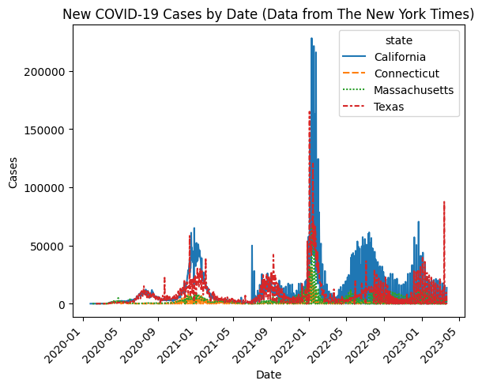

# Dependencies
Execute the following in the terminal before running any notebooks:
`pip install -r requirements.txt`

# Exercise 1: Body temperature clinical decision support


```python
# Code
def temp_tester(normalTemp): # Defines normal body temperature
    def tester(givenTemp): # Tests given temperature against normal body temperature
        if abs(normalTemp - givenTemp) <= 1:
            return True
        return False
    return tester
```


```python
# Tests
human_tester = temp_tester(37)
chicken_tester = temp_tester(41.1)

print(chicken_tester(42)) # True
print(human_tester(42)) # False
print(chicken_tester(43)) # False
print(human_tester(35)) # False
print(human_tester(98.6)) # False
```

    True
    False
    False
    False
    False

# Exercise 2: FASTQ and Unicode


```python
# Code
def better_quality(char_a, char_b):
    codepoint_a = ord(char_a) # Convert characters to Unicode code points (numbers)
    codepoint_b = ord(char_b)
    if codepoint_a > codepoint_b:
        return char_a
    return char_b
```


```python
# Tests
test_a = "!"
test_b = "("
print("The quality of", test_a, "is", ord(test_a))
print("The quality of", test_b, "is", ord(test_b))
print("The character with better quality is", better_quality("!", "("))
```

    The quality of ! is 33
    The quality of ( is 40
    The character with better quality is (


**Explanation:** As demonstrated above, I first select two characters, `test_a` and `test_b`, and provide their Unicode code points. It is clear that `test_a` has a lower code point (or quality score) than `test_b`. I then test my function, which accurately determines that `test_b` is of higher quality. 


```python
# Code
def best_quality(seq):
    # Calculate quality scores for the given sequence
    quality_scores = []
    for i in range(len(seq)):
        quality_scores.append(ord(seq[i]))

    # Calculate average quality score of the sequence
    avg = sum(quality_scores) / len(quality_scores)     

    # Create dictionary of responses
    answers = {
        "best":  max(quality_scores),
        "average_num": avg, # Average quality score of the sequence
        "average_char": chr(int(avg)) # Average quality score as a Unicode character (average is a float, which is truncated)
    }
    return answers
```


```python
# Tests
seq = "!''*((((***+))%%%++)(%%%%).1***-+*''))**55CCF>>>>>>CCCCCCC65"
best_quality(seq)
```


    {'best': 70, 'average_num': 48.06666666666667, 'average_char': '0'}


**Explanation:** To determine the best quality score in the given string, I first create a list to hold the quality scores and calculate the quality scores for each character in the string, appending each to the list. Then, when reporting the answer, I find the maximum score in the list, extract the index of that score, and report the character corresponding to that index in the original string. To calculate the average quality score, I sum all the quality scores in the list and divide by the length of the list; this returned a float. To report this as a character, I chose to truncate the float by casting it as an integer, and then converting it to a character. Consequently, the average character may be inflated or deflated compared to the actual average depending on the decimal. To simultaneously report the best quality measurement, the average quality measurement, and the single-character quality score, I chose to return a dictionary. I am convinced that the function works because it correctly reports the best quality character, `F`, which has the highest code point in Unicode; it provides a reasonable average quality score; and the average character is the correct conversion from the average score.

# Exercise 3: Intravenous fluid administration


```python
# Medical device company's first draft of code
def administer_meds(delta_t, tstop): # Arguments: time increment, time limit to stop administration
    t = 0 # Start time
    while t < tstop: # Stop administration once time limit is elapsed
        print(f"Administering meds at t={t}") # Release fluids
        t += delta_t # Advance time
```

**Explanation:** The function administers medication until a defined time limit (`tstop`), incrementing by a defined time interval (`delta_t`). It administers one dose per loop, for a total of `t / delta_t` doses.


```python
print("Dose Test 1")
administer_meds(0.25, 1)
print("Dose Test 2")
administer_meds(0.1, 1)
```

    Dose Test 1
    Administering meds at t=0
    Administering meds at t=0.25
    Administering meds at t=0.5
    Administering meds at t=0.75
    Dose Test 2
    Administering meds at t=0
    Administering meds at t=0.1
    Administering meds at t=0.2
    Administering meds at t=0.30000000000000004
    Administering meds at t=0.4
    Administering meds at t=0.5
    Administering meds at t=0.6
    Administering meds at t=0.7
    Administering meds at t=0.7999999999999999
    Administering meds at t=0.8999999999999999
    Administering meds at t=0.9999999999999999


**Explanation, discussion of findings, and clinical significance:** Calling `administer_meds(0.25, 1)` causes the loop to run four times, administering four doses. Because the function administers the dose first before incrementing the time, the doses are administered starting at $time = 0$, incrementing by $0.25$ for a total of four doses until $1.0$ is reached. This is expected behavior, as $1/0.25 = 4$ doses were expected, and all of the exact times were reached. The clinical significance of this result is that the doses are administered correctly, but administered a bit in advance before the time limit is reached.

On the other hand, calling `administer_meds(0.1, 1)` causes the loop to run 11 times, administering 11 doses at odd time intervals. This is unexpected behavior, because $1/0.1=10$ doses were expected, the time intervals were not consistent, and there were strange floating point numbers (`t=0.30000000000000004`, `t=0.7999999999999999`, `t=0.8999999999999999`, `t=0.9999999999999999`). This is due to [how Python represents floating point numbers](https://docs.python.org/3/tutorial/floatingpoint.html): floating point numbers in Python are only an approximation with a limited number of significant digits. Consequently, arithmetic with these numbers can produce unexpected results. The clinical significance of this result is that the function administers more doses than intended, may be administering them at unintended times, and administers them a bit in advance before the time limit is reached.


```python
# Version without surprises:
from decimal import * # Python's decimal library has higher precision decimal arithmetic
getcontext().prec = 10 # Set precision to 10 decimal places

def administer_meds(delta_t, tstop):
    t = 0
    while t < tstop:
        print(f"Administering meds at t={t}")
        t += Decimal(delta_t)
```


```python
# Tests
print("Dose Test 1")
administer_meds(0.25, 1)
print("Dose Test 2")
administer_meds(0.1, 1)
```

    Dose Test 1
    Administering meds at t=0
    Administering meds at t=0.25
    Administering meds at t=0.50
    Administering meds at t=0.75
    Dose Test 2
    Administering meds at t=0
    Administering meds at t=0.1000000000
    Administering meds at t=0.2000000000
    Administering meds at t=0.3000000000
    Administering meds at t=0.4000000000
    Administering meds at t=0.5000000000
    Administering meds at t=0.6000000000
    Administering meds at t=0.7000000000
    Administering meds at t=0.8000000000
    Administering meds at t=0.9000000000

# Exercise 4: Analysis of historical COVID-19 data
Data from [The New York Times](https://github.com/nytimes/covid-19-data), based on reports from state and local health agencies.


```python
# Load historical data for COVID-19 cases by state
import pandas as pd

covid = pd.read_csv("https://raw.githubusercontent.com/nytimes/covid-19-data/master/us-states.csv")
covid['date'] = pd.to_datetime(covid['date']) # Convert date column to date format (necessary for seaborn x-axis to work)
covid = covid.assign(new_cases = covid.groupby(['state']).cases.diff()).fillna(0) # Calculate daily new cases
covid['new_cases'] = covid['new_cases'].clip(lower = 0) # Make drops in new cases zero
```


```python
# Plot new cases by state
import seaborn as sb

def cases_vs_date(data, states):
    data = data[data['state'].isin(states)] # Select only rows matching indicated states
    data_wide = data.pivot(index = "date", columns = "state", values = "new_cases") # Convert to wide-form data
    plot = sb.lineplot(data = data_wide) # Create line plot
    plot.set(title = "New COVID-19 Cases by Date (Data from The New York Times)", # Set title
             xlabel = "Date", # Set axis labels 
             ylabel = "Cases")
    plot.set_xticklabels(plot.get_xticklabels(), 
                         rotation = 45, # Rotate x-axis labels
                         horizontalalignment = "right") # Shift x-axis labels to the left
```


```python
# Tests
import warnings
warnings.filterwarnings('ignore') # Suppress seaborn's warnings

states = ["Texas", "California", "Connecticut", "Massachusetts"]
cases_vs_date(covid, states)
```


    

    


**Limitations:** In the dataset, the cumulative case totals for some states progress in a way that there are case differences with negative numbers; this does not make sense because cumulative case totals should always be increasing or consistent. This is likely due to errors in reported public health agency data. I have chosen to change negative case differences to zero to avoid negative values in the plot. This may misrepresent the data slightly. In addition, there are very large case peaks on certain dates, likely due to agencies reporting large numbers of cases at once rather than reporting consistently. As such, this graph likely does not reflect the true case peaks. 


```python
# Code
def date_highest_new_cases(data, state):
    data = data[data['state'].str.contains(state)] # Select only rows matching indicated states
    return str(data.loc[data['new_cases'].idxmax(), ]['date'].date()) # Find date with highest number of daily cases
```


```python
# Tests
states = ["California", "Texas", "Connecticut", "Massachusetts"]
for state in states:
    print(f"{state} had the highest number of COVID-19 cases on {date_highest_new_cases(covid, state)}.")
```

    California had the highest number of COVID-19 cases on 2022-01-10.
    Texas had the highest number of COVID-19 cases on 2022-01-03.
    Connecticut had the highest number of COVID-19 cases on 2022-01-10.
    Massachusetts had the highest number of COVID-19 cases on 2022-01-10.


```python
# Code
from dateutil.parser import parse

def case_peaks(state_1, state_2):
     date_1 = parse(date_highest_new_cases(covid, state_1))
     date_2 = parse(date_highest_new_cases(covid, state_2))
     if date_1 < date_2:
          print(state_1, "peaked", (date_2 - date_1).days, "days ahead of", state_2) 
     elif date_1 > date_2:
          print(state_2, "peaked", (date_1 - date_2).days, "days ahead of", state_1) 
     else:
          print(state_1, "and", state_2, "peaked on the same day")          
```


```python
# Tests
case_peaks("California", "New York")
case_peaks("Texas", "Texas")
case_peaks("Hawaii", "Montana")
case_peaks("Florida", "South Carolina")
case_peaks("District of Columbia", "Maryland")
```

    New York peaked 2 days ahead of California
    Texas and Texas peaked on the same day
    Montana peaked 247 days ahead of Hawaii
    Florida peaked 14 days ahead of South Carolina
    Maryland peaked 1 days ahead of District of Columbia

# Exercise 5: Analysis of MeSH Data

```python
# Parse XML
from lxml import etree

print("Parsing XML...")
mesh = etree.parse("/Users/kevin/Downloads/desc2023.xml")
print("Parsing complete.")
root = mesh.getroot()

# Extract values of interest
# Report the DescriptorName associated with DescriptorUI D007154
for record in root.findall(".//*[DescriptorUI='D007154']"):
    name = etree.tostring(record[1], encoding="utf8", method="text").decode().replace("\n", "").strip()
    print(name)

# Report the DescriptorUI associated with DescriptorName "Nervous System Diseases"
for record in root.findall("./*DescriptorName/[String='Nervous System Diseases']/.."):
    print(record[0].text)

# Report DescriptorNames of descendants of both "Nervous System Diseases" and D007154
# Hint: Each item should have tree number C10 and C20
tree_numbers = root.findall(".//TreeNumber")
numbers_of_interest = []
for tree_number in tree_numbers:
    if tree_number.text.startswith("C20") and tree_number.text.startswith("C10"):
        numbers_of_interest.append(tree_number.text)

for number in numbers_of_interest:
    record = root.findall(f".//*[TreeNumber = '{number}']/..")
    name = etree.tostring(record[0][1], encoding="utf8", method="text").decode().replace("\n", "").strip()
    print(name)
```

**Biomedical explanation:** According to the MeSH hierarchy, the above code locates the disease associated with a certain unique identifier, the identifier associated with a certain disease, and all conditions that are categorized under both aforementioned diseases. All such conditions are classified by the National Library of Medicine as being neuroimmunological disorders, where a body's overly active immune system appears to attack its own nervous system, mistaking it for a foreign invader.

```python
# Generic function versions
def get_name(ui):
    for record in root.findall(f".//*[DescriptorUI='{ui}']"):
        name = etree.tostring(record[1], encoding="utf8", method="text").decode().replace("\n", "").strip()
        return name


def get_ui(name):
    for record in root.findall(f"./*DescriptorName/[String='{name}']/.."):
        return record[0].text


def get_descendent_names(tree_number_a, tree_number_b):
    tree_numbers = root.findall(".//TreeNumber")
    numbers_of_interest = []
    for tree_number in tree_numbers:
        if tree_number.text.startswith(tree_number_a) and tree_number.text.startswith(tree_number_b):
            numbers_of_interest.append(tree_number.text)     
    for number in numbers_of_interest:
        record = root.findall(f".//*[TreeNumber = '{number}']/..")
        name = etree.tostring(record[0][1], encoding="utf8", method="text").decode().replace("\n", "").strip()
        print(name)
```