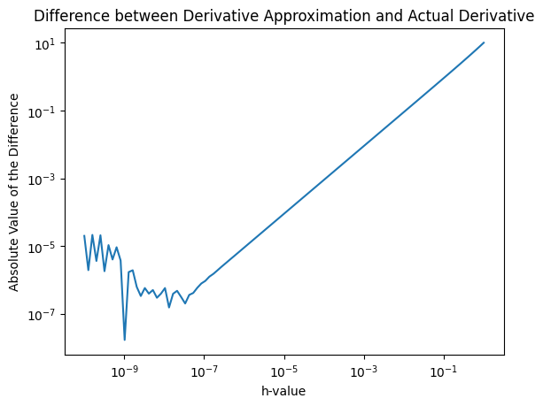
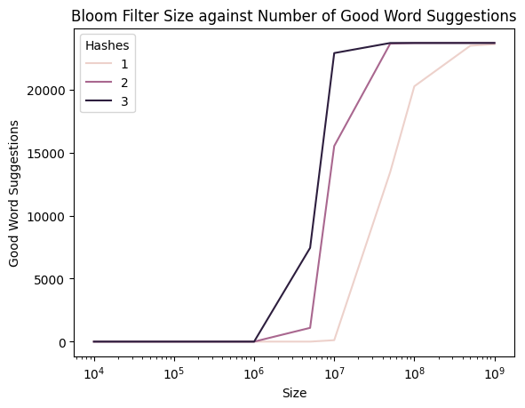
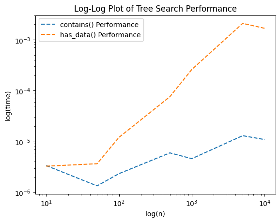
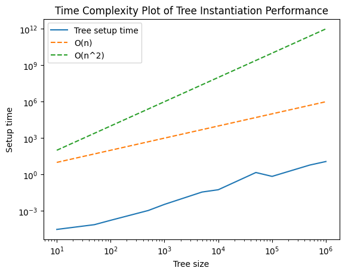

# Dependencies
Execute the following in the terminal before running any notebooks:
`pip install -r requirements.txt`

# Exercise 1: log-log graph of difference between derivative approximation and derivative


```python
# Define the specified function: f(x) = x^3
def f(x):
    return x**3

# Define the derivative: df/dx (f(x)) = 3x^2
def df(x):
    return 3*x**2
```


```python
# Calculate the difference between approximation and derivative for a range of h-values
import numpy as np

h_values = np.logspace(-10, 0, 100) # Generate 100 evenly spaced h-values on a log scale
differences = []

for h in h_values:
    approximation = (f(3 + h) - f(3)) / h # Calculate the approximation of the derivative
    derivative = df(3) # Take the actual derivative
    differences.append(abs(approximation - derivative)) # Calculate the difference between the two
```


```python
# Plot the graph
import seaborn as sns
import warnings

warnings.filterwarnings('ignore') # Suppress seaborn's warnings

plot = sns.lineplot(x = h_values, y = differences)
plot.set(xscale = "log", yscale = "log")
plot.set_xlabel("h-value")
plot.set_ylabel("Absolute Value of the Difference")
plot.set_title("Difference between Derivative Approximation and Actual Derivative")
```


    Text(0.5, 1.0, 'Difference between Derivative Approximation and Actual Derivative')


    

    


**Discussion:** As $h$ gets smaller and smaller going to the left, the difference between the derivative approximation and the actual derivative decreases as expected at first but then begins to increase and decrease erratically after $h$ falls below $10^{-7}$. As encountered in Problem Set 1, this behavior is unexpected and is probably because of how Python represents floating-point numbers, the inaccuracies of which become evident when numbers grow very large or get very small. In this problem, Python's limitations make it hard to approximate floats that small without using an external library, which causes the derivative approximation to be less accurate and more different from the actual derivative.

# Exercise 2: Bloom filter


```python
# Implement a Bloom filter using bitarray
import bitarray as bit
from hashlib import sha3_256, sha256, blake2b

class BloomFilter:
    def __init__(self, size, hashes):
        self.size = size # Specify filter size
        self.hashes = hashes # Specify desired hash functions
        self.bitarray = bit.bitarray(size) # Initialize bitarray with defined size
        self.bitarray.setall(0) # Set all values in the bitarray to zero

    # Define generic hash function, which returns the bitarray index
    def get_hash(self, value, hash):
        return int(hash(value.lower().encode()).hexdigest(), 16) % self.size
    
    # Add a value to the Bloom filter
    def add(self, value):
        for hash in self.hashes: # Apply value through selected hash functions
            index = self.get_hash(value, hash) # Get hashed value to bitarray index
            self.bitarray[index] = 1 # Set corresponding position in bitarray to 1 (occupied)

    # Check if a value is in the Bloom filter (may return false positives)
    def lookup(self, value):
        for hash in self.hashes:
            index = self.get_hash(value, hash)
            if self.bitarray[index] == 0: # If index position in bitarray is empty, the word is not there
                return False
        return True
```


```python
# Test the Bloom filter
hi = BloomFilter(size = 100, hashes = [sha256])
hi.add("Hello!")
print(hi.lookup("Hello!"))   # True
print(hi.lookup("Goodbye!")) # False

bruh = BloomFilter(size = 10_000, hashes = [sha256, blake2b, sha3_256])
print(bruh.lookup("bruh")) # False
bruh.add("bruh")
print(bruh.lookup("bruh")) # True
```

    True
    False
    False
    True


```python
# Store words.txt (~500,000 words, assuming correct spelling) into a Bloom filter
# Note: To avoid hash collisions, the absolute minimum for a corpus of 500,000 words with 3 hash functions is 150,000 bits.
# For a starting point, at least 1,000,000 bits is recommended; 10,000,000 bits to be safe.
corpus = BloomFilter(size = 100_000_000, hashes = [sha256, blake2b, sha3_256])

with open("words.txt") as file:
    for line in file:
        word = line.strip()
        corpus.add(word)

# Test the primed Bloom filter
print(corpus.lookup("cb&b634"))       # False
print(corpus.lookup("computational")) # True
print(corpus.lookup("methods"))       # True
print(corpus.lookup("for"))           # True
print(corpus.lookup("informatics"))   # True
print(corpus.lookup("robert"))        # True
print(corpus.lookup("mcdougal"))      # True (huh?)
```

    False
    True
    True
    True
    True
    True
    True


```python
# Create a spell checker using the Bloom filter class
# Note: May return more false positives (e.g. suggesting a word not in the list) with smaller filters and fewer hash functions.
def spell_checker(word, BloomFilter):
    # If the word is in the specified Bloom filter, it may be correctly spelled
    if BloomFilter.lookup(word):
        return(f"'{word}' may be spelled correctly.")
    
    # If not, generate all possible single-letter substitutions and test them against Bloom filter
    word_suggestions = []
    for char in range(len(word)):
        for letter in "abcdefghijklmnopqrstuvwxyz":
            candidate = word[:char] + letter + word[char+1:] # Slice word to test every letter at every character position
            if BloomFilter.lookup(candidate): # Suggest candidate if it is in the Bloom filter
                word_suggestions.append(candidate)

    # Return candidate words
    return word_suggestions

print(spell_checker("bruh", corpus))   # ['pruh', 'bluh', 'brum', 'brut'] (non-deterministic for some reason? shouldn't a hash be deterministic?)
print(spell_checker("moment", corpus)) # 'moment' may be spelled correctly.
```

    ['pruh', 'bluh', 'brum', 'brut']
    'moment' may be spelled correctly.


```python
# Test spell checker on typos.json
import json

def accuracy_checker(BloomFilter):
    # Load list of typos
    with open("typos.json") as file:
        typos = json.load(file) # Creates list of [typed_word, correct_word] pairs

    # Check if correct word is produced by the specified Bloom filter and that it gives no more than 3 suggestions
    correct_count = 0
    for typo in typos:
        suggestions = spell_checker(typo[0], BloomFilter)
        if (typo[1] in suggestions) and (len(suggestions) <= 3):
            correct_count += 1

    # Return spell checker accuracy
    return correct_count
```


```python
# Test spell checker accuracy
corpus = BloomFilter(size = 100_000_000, hashes = [sha256, blake2b, sha3_256])
with open("words.txt") as file:
    for line in file:
        word = line.strip()
        corpus.add(word)

print("Number of good suggestions:", accuracy_checker(corpus))
```

    Number of good suggestions: 23702


```python
# Test accuracy against filter size
from tqdm import tqdm

#sizes = list(np.linspace(start = 10_000, stop = 100_000_000, num = 10, dtype = int)) # Generate evenly spaced Bloom filter sizes
sizes = [10_000, 50_000, 100_000, 500_000, 1_000_000, 5_000_000, 10_000_000, 50_000_000, 100_000_000, 500_000_000, 1_000_000_000]
hash_sets = [[sha256], [sha256, blake2b], [sha256, blake2b, sha3_256]]

results = []
for size in tqdm(sizes):
    for hash_set in hash_sets:
        filter = BloomFilter(size, hash_set)
        with open("words.txt") as file:
            for line in file:
                word = line.strip()
                filter.add(word)
        good_suggestions = accuracy_checker(filter)
        results.append((size, len(hash_set), good_suggestions))
```

      0%|          | 0/11 [00:00<?, ?it/s]100%|██████████| 11/11 [11:35<00:00, 63.19s/it]


```python
# Plot filter size against hash function choice (first, first two, all three)
import seaborn as sns
import pandas as pd
import warnings

warnings.filterwarnings('ignore') # Suppress seaborn's warnings

df = pd.DataFrame(results, columns=["Size", "Hashes", "Good_Suggestions"])
plot = sns.lineplot(data=df, x="Size", y="Good_Suggestions", hue="Hashes")
plot.set(xscale = "log", title = "Bloom Filter Size against Number of Good Word Suggestions",
         xlabel = "Size", ylabel = "Good Word Suggestions")
```


    [None,
     Text(0.5, 1.0, 'Bloom Filter Size against Number of Good Word Suggestions'),
     Text(0.5, 0, 'Size'),
     Text(0, 0.5, 'Good Word Suggestions')]


    

    


**Discussion:** On a semi-log plot, the number of good suggestions for all three filters starts out close to zero, then increases rapidly and then levels off. However, none of the hash choices manages to break ~50% accuracy, and past a filter size of $10^8$ bits, there appear to be diminishing returns. I suspect that there is an error in my Bloom filter implementation that I am unable to spot. Therefore, my educated guess as to the number of necessary bits to achieve 90% accuracy is at least $10^8$ bits for the given corpus and list of typos.

# Exercise 3: Binary search tree


```python
# Implement the binary search tree class
class Tree:
    def __init__(self, value = None, data = None): # Provide default parameters, or else Python will scream
        self._value = value # patient_id; sort by this
        self._data = data # Additional patient information
        self.left = None
        self.right = None

    # Insert a value and associated data into the tree
    def add(self, value, data):
        # Check if root is empty
        if self._value is None:
            self._value = value # Add patient_id to empty node
            self._data = data # Add data to empty node
        # Check if intended value is smaller than root
        elif value < self._value:
            if self.left is None:
                self.left = Tree() # Create new left child node
            self.left.add(value, data) # Insert value in left child node
        # Check if intended value is larger than root
        elif value > self._value:
            if self.right is None:
                self.right = Tree() # Create new right child node
            self.right.add(value, data) # Insert value in right child node
        else:
            self._data = data # Update data in existing node

    # Recursive method asking if tree or sub-tree contains a value        
    def __contains__(self, patient_id):
        if self._value == patient_id:
            return True
        elif self.left and patient_id < self._value:
            return patient_id in self.left
        elif self.right and patient_id > self._value:
            return patient_id in self.right
        else:
            return False
```


```python
# Test the class
my_tree = Tree()
for patient_id, initials in [(24601, "JV"), (42, "DA"), (7, "JB"), (143, "FR"), (8675309, "JNY")]:
    my_tree.add(patient_id, initials)

print(24601 in my_tree) # True
print(1492 in my_tree)  # False
```

    True
    False


```python
# Check if a given tree has a given piece of patient data
def has_data(tree, data):
    # If the current node is empty, then the data is not there (wow, what a concept!)
    if tree is None:
        return False
    
    # If the current node has the data, then the data is there (oh my god!)
    if tree._data == data:
        return True
    
    # Recursively check if the left sub-tree or right sub-tree has the data
    return has_data(tree.left, data) or has_data(tree.right, data)

# Test the function
print(has_data(my_tree, "JV"))  # True
print(has_data(my_tree, 24601)) # False
```

    True
    False


```python
# Stress-test performance for __contains__() and has_data()
import random
import time

tree_sizes = [10, 50, 100, 500, 1000, 5000, 10000] # Various sizes n of trees to be tested
contains_times = [] # __contains__() performance times per n-sized tree
has_data_times = [] # has_data() performance times per n-sized tree

for tree_size in tree_sizes:
    # Generate a list of tuples: (random_patient_ids, random_data) where data is randomized by tree size
    patient_data = set() # Sample data from set rather than pulling from list to reduce sorting/tree unbalancing
    while len(patient_data) < tree_size:
        patient_data.add((random.randint(1, tree_size * 10), f"Data_{random.randint(1, tree_size)}"))
    patient_data = list(patient_data)

    # Create a tree and populate it with n random_patient_ids and random_data
    tree = Tree()
    for patient_id, data in patient_data:
        tree.add(patient_id, data)

    # Test performance of __contains__()
    nums_to_check = random.sample([id for id, _ in patient_data], tree_size)
    start_time = time.perf_counter()
    for num in nums_to_check:
        num in tree # Check if a random number is in the tree
    end_time = time.perf_counter()
    contains_times.append((end_time - start_time) / len(nums_to_check))

    # Test performance of has_data()
    data_to_check = random.sample([data for _, data in patient_data], tree_size)
    start_time = time.perf_counter()
    for data in data_to_check:
        has_data(tree, data) # Check if a random data point is in the tree
    end_time = time.perf_counter()
    has_data_times.append((end_time - start_time) / len(data_to_check))     
```


```python
# Plot performance for __contains__() and has_data()
import seaborn as sns
import warnings

warnings.filterwarnings('ignore') # Suppress seaborn's warnings

plot = sns.lineplot(x = tree_sizes, y = contains_times, label = "contains() Performance", linestyle = "--")
sns.lineplot(x = tree_sizes, y = has_data_times, label = "has_data() Performance", linestyle = "--", ax = plot)
plot.set(xscale = "log", yscale = "log")
plot.set_title("Log-Log Plot of Tree Search Performance")
plot.set_xlabel("log(n)")
plot.set_ylabel("log(time)")
```


    Text(0, 0.5, 'log(time)')


    

    


**Plot Discussion:** The `__contains__()` method appears to perform consistently faster than `has_data()`, which is expected. `__contains__()` does appear to flatten on a log-log scale at larger tree sizes. In comparison, overhead for `has_data()` seems to grow at a much faster rate, which makes it slower than $O(n)$ at least. There are caveats - the noise and sawtooth pattern in the plots can come from the fact that I am not running multiple experiments of each tree size and averaging the times, as well as the taxed system environment in which I am running the code (I am unable to run larger tree sizes as it takes an annoyingly intractable amount of time on my computer).


```python
# Analyze time complexity for tree instantiation
tree_sizes = [10, 50, 100, 500, 1000, 5000, 10000, 50000, 100000, 500000, 1000000]
setup_times = []

for tree_size in tree_sizes:
    patient_ids = [(random.randint(1, tree_size * 10)) for i in range(tree_size)]
    tree = Tree()

    start_time = time.perf_counter()
    for patient_id in patient_ids:
       tree.add(patient_id, f"Data_{patient_id}")
    end_time = time.perf_counter()
    
    setup_times.append(end_time - start_time)
```


```python
# Plot time complexity for tree instantiation
plot = sns.lineplot(x = tree_sizes, y = setup_times, label = "Tree setup time")
sns.lineplot(x = tree_sizes, y = [tree_size for tree_size in tree_sizes], label = "O(n)", linestyle = "--", ax = plot)
sns.lineplot(x = tree_sizes, y = [tree_size**2 for tree_size in tree_sizes], label = "O(n^2)", linestyle = "--", ax = plot)
plot.set(xscale = "log", yscale = "log")
plot.set_xlabel("Tree size")
plot.set_ylabel("Setup time")
plot.set_title("Time Complexity Plot of Tree Instantiation Performance")
```


    Text(0.5, 1.0, 'Time Complexity Plot of Tree Instantiation Performance')


    

    


**Plot Discussion:** The tree setup performance appears to be faster than $O(n)$, which is unexpected and could be attributed to differences in system environment and overhead. It is at least faster than $O(n^2)$, which is expected, as it should be relatively close to $O(nlogn)$. This should be between the $O(n)$ line and $O(n^2)$ line.

Please note that, as mentioned before there are caveats with my stress-tests. My computer is relatively old (MacBook Air 2017, with Intel processor, 8 GB RAM). The results of high-cost stress-tests on this machine and plots generated from them may not be representative. I also tend to have other high-cost software open, like Google Chrome, which may cause Visual Studio Code to start using disk swap - this may inflate the runtime.

**Test Data Discussion:** Always using `patientid = 1`, or a single test point, can be unrepresentative because of the way that binary search trees (BSTs) are constructed. Since we are testing different BST sizes, finding the same `patient_id` across different tree structures would not be representative of the average time it would take to locate a random `patient_id` and provide no information on variability of tree search times for different `patient_ids`. It would not be a fair stress-test of the tree search functions. In extreme cases, it may be at the root of the tree or buried deep inside it, which would bias the search time. The search time would also be biased if the BST happens to be unbalanced.

# Exercise 4: Final project dataset identification

## Dataset Introduction
[Visa Application by Nationality in Japan](https://www.kaggle.com/datasets/yutodennou/visa-issuance-by-nationality-and-region-in-japan/data) is a multivariate dataset compiled by Waticson on Kaggle. It primarily contains information on numbers of visas issued as well as purpose of visit per country from 2006 to 2017.

## Origin
This dataset was acquired from Kaggle. The data is sourced from eStat, the official online portal for national statistics released by the government of Japan.

## License
[Database Contents License (DbCL) v1.0, from Open Data Commons.](https://opendatacommons.org/licenses/dbcl/1-0/)

## Explanation of interest
Japan is a nation of many contradictions; among them, it is notorious for reticence to immigration but continues to draw increasing interest from around the world. I am interested in finding out which country applies the most and least for Japanese visas, their reasons for doing so, and how the numbers of visas for different countries have trended over the years. It is also personally relevant to me, as I am strongly considering the possibility of obtaining a work visa there in the future.

## Potential research questions
1. Which countries apply the most and least for work visas in Japan? Has this changed over the years?
2. How did the COVID-19 pandemic affect visa applications and purposes of visits across different countries?

## Additional considerations
As the data cuts off by 2017, and considering that eStat has a publicly accessible API, I intend on extending the dataset before 2006 and after 2017 if possible, to gain a more complete picture of visa applications to Japan that provides a broader view of trends.
