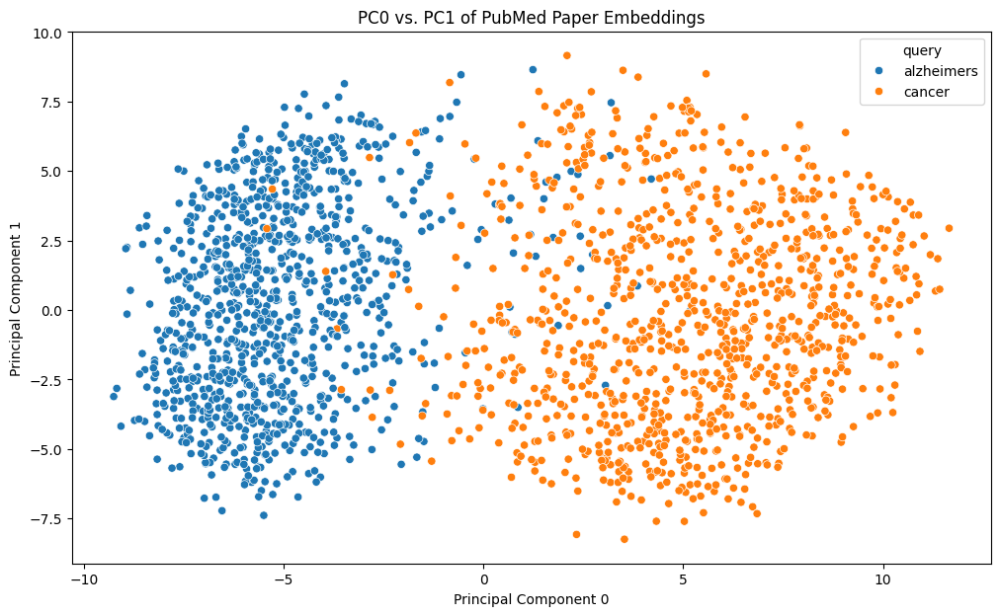

# Dependencies
Execute the following in the terminal before running any notebooks:
`pip install -r requirements.txt`

# Exercise 1: 1000 Alzheimer's disease and 1000 cancer papers from PubMed 

```python
# Query Entrez API for PubMed IDs given search term and year
import requests

def get_pmids(query, year, retmax):
    # Define efetch URL
    url = f"https://eutils.ncbi.nlm.nih.gov/entrez/eutils/esearch.fcgi?db=pubmed&term={query}+AND+{year}[pdat]&retmode=json&retmax={retmax}"
    
    # Query the Entrez API
    r = requests.get(url)
    r.raise_for_status()  # Raise an exception for HTTP error responses

    # Grab the list of PMIDs
    pmids = r.json()["esearchresult"]["idlist"]
    
    # Return list of PMIDs with associated queries
    return [(pmid, query) for pmid in pmids]

# Test (featuring House MD; it is, unfortunately, never lupus)
get_pmids("lupus", "2004", 10)
```


    [('21473028', 'lupus'),
     ('21210563', 'lupus'),
     ('18958642', 'lupus'),
     ('18202459', 'lupus'),
     ('17822285', 'lupus'),
     ('17642789', 'lupus'),
     ('17642773', 'lupus'),
     ('17642626', 'lupus'),
     ('17642623', 'lupus'),
     ('17491665', 'lupus')]


```python
# Query Entrez for metadata of a PubMed paper given its PMID
from lxml import etree

def get_full_abstract(abstract_elements):
    # Concatenate all abstract text elements to form the full abstract
    full_abstract = ' '.join([abstract_elem.xpath("string()") for abstract_elem in abstract_elements])
    return full_abstract.strip()

def get_metadata(pmids_with_queries):
    # Convert list of PMIDs to a string for POST request
    pmids_string = ",".join([pmid for pmid, _ in pmids_with_queries])

    # Define parameters for payload
    url = "https://eutils.ncbi.nlm.nih.gov/entrez/eutils/efetch.fcgi"
    params = {
        'db': 'pubmed',
        'id': pmids_string,
        'retmode': 'xml'
    }

    # Query the Entrez API
    r = requests.post(url, params)
    r.raise_for_status()  # Raise an exception for HTTP error responses

    # Parse the entire XML response
    doc = etree.fromstring(r.content) # Use r.content for binary response
    papers_dict = {}

    # Iterate through each article in the entire response
    for pmid, query in pmids_with_queries:
        # Find the article node that corresponds to the current PMID
        article = doc.xpath(f".//PubmedArticle[MedlineCitation/PMID/text()='{pmid}']")[0]

        # Extract "ArticleTitle" for this article
        title = article.findtext(".//ArticleTitle")
        
        # Grab all tags named "AbstractText" for this article
        abstract_elements = article.xpath(".//AbstractText")
        
        # Build full abstract from tags
        full_abstract = get_full_abstract(abstract_elements)
        
        # Populate paper dictionary
        papers_dict[pmid] = {
            "ArticleTitle": title,
            "AbstractText": full_abstract,
            "query": query
        } 

    return papers_dict
```


```python
# Process all 2000 papers and save metadata to JSON file
import json
 
pmids_with_queries = get_pmids("alzheimers", "2023", 1000) + get_pmids("cancer", "2023", 1000)

papers_dict = get_metadata(pmids_with_queries)

with open("papers_dict.json", "w") as f:
    json.dump(papers_dict, f)
```


```python
# Find overlap in PMIDs between two queries
pmids = [pmid[0] for pmid in pmids_with_queries] # Extract only PMIDs
split = len(pmids) // 2
alzheimers, cancer = pmids[split:], pmids[:split] # Split PMIDs into queries

def intersection(list_1, list_2):
    overlap = [value for value in list_1 if value in list_2]
    return overlap

print(f"The following PMIDs appear in both the Alzheimer's and the cancer sets of papers: {intersection(alzheimers, cancer)}")
```

    The following PMIDs appear in both the Alzheimer's and the cancer sets of papers: ['37943296', '37937963', '37936448']

# Exercise 2: Document-level embedding analysis of PubMed papers with SPECTER


```python
from transformers import AutoTokenizer, AutoModel

# Load SPECTER model and tokenizer
tokenizer = AutoTokenizer.from_pretrained("allenai/specter")
model = AutoModel.from_pretrained("allenai/specter")
```

    /Users/kevin/.pyenv/versions/3.11.6/envs/cbb634-pytorch/lib/python3.11/site-packages/tqdm/auto.py:21: TqdmWarning: IProgress not found. Please update jupyter and ipywidgets. See https://ipywidgets.readthedocs.io/en/stable/user_install.html
      from .autonotebook import tqdm as notebook_tqdm


```python
# Load dictionary of papers 
import json

with open("papers_dict.json") as f:
    papers = json.load(f)
```


```python
# Process papers to find SPECTER embeddings
from tqdm import tqdm

# Convert papers dictionary into embeddings dictionary
embeddings = {}
for pmid, paper in tqdm(papers.items()):
    data = [paper["ArticleTitle"] + tokenizer.sep_token + paper["AbstractText"]]
    inputs = tokenizer(
        data, padding=True, truncation=True, return_tensors="pt", max_length=512
    )
    result = model(**inputs)
    # Take the first token in the batch as the embedding
    embeddings[pmid] = result.last_hidden_state[:, 0, :].detach().numpy()[0]

# Turn the dictionary into a list
embeddings = [embeddings[pmid] for pmid in papers.keys()]
```

    100%|██████████| 1997/1997 [03:10<00:00, 10.50it/s]


```python
# Identify the first three principal components of the paper embeddings
from sklearn import decomposition
import pandas as pd

pca = decomposition.PCA(n_components=3)
embeddings_pca = pd.DataFrame(
    pca.fit_transform(embeddings),
    columns=['PC0', 'PC1', 'PC2']
)
embeddings_pca["query"] = [paper["query"] for paper in papers.values()]
```

    huggingface/tokenizers: The current process just got forked, after parallelism has already been used. Disabling parallelism to avoid deadlocks...
    To disable this warning, you can either:
    	- Avoid using `tokenizers` before the fork if possible
    	- Explicitly set the environment variable TOKENIZERS_PARALLELISM=(true | false)


```python
# Plot 2-D scatter plots for PC0 vs PC1, PC0 vs PC2, PC1 vs PC2, color-coded by search query
import seaborn as sns
import matplotlib.pyplot as plt

# PC0 vs PC1
plt.figure(figsize=(12,7))
sns.scatterplot(data = embeddings_pca, x = "PC0", y = "PC1", hue = "query")
plt.title("PC0 vs. PC1 of PubMed Paper Embeddings")
plt.xlabel("Principal Component 0")
plt.ylabel("Principal Component 1")
plt.show()

# PC0 vs PC2
plt.figure(figsize=(12,7))
sns.scatterplot(data = embeddings_pca, x = "PC0", y = "PC2", hue = "query")
plt.title("PC0 vs. PC2 of PubMed Paper Embeddings")
plt.xlabel("Principal Component 0")
plt.ylabel("Principal Component 2")
plt.show()

# PC1 vs PC2
plt.figure(figsize=(12,7))
sns.scatterplot(data = embeddings_pca, x = "PC1", y = "PC2", hue = "query")
plt.title("PC1 vs. PC2 of PubMed Paper Embeddings")
plt.xlabel("Principal Component 1")
plt.ylabel("Principal Component 2")
plt.show()
```


    

    


    

    


    

    


**Interpretation:** The plots for PC0 vs. PC1 and PC0 vs. PC2 show distinct separation of the papers. This suggests that the most significant variance in the data, that is, what really distinguished Alzheimer's papers from cancer papers (e.g. specialized terminology for each field) was captured by PC0. This means that PC0 accounted for a high proportion of the total variance in the dataset. On the other hand, the plot for PC1 vs. PC2 shows almost no separation of papers; rather, the clusters are almost entirely laid on top of each other. This suggests that PC1 and PC2 capture variance that didn't really set the two clusters of papers apart (e.g. a consistent academic-sounding writing style, research common to both fields), accounting for a lesser proportion of the total variance in the dataset.

# Exercise 3: Two-dimensional gradient descent


```python
# 1-D gradient descent (adapted from Slides 8)
def one_dim_gd(f, delta, learning_rate, guess, iterations):
    fprime = lambda x: (f(x + delta) - f(x)) / delta
    for _ in range(iterations):
        print(guess)
        guess = guess - learning_rate * fprime(guess)
```


```python
# Test 1-D gradient descent
g = lambda x: (x ** 4 / 4 - 2 * x ** 3 / 3 - x ** 2 / 2 + 2 * x + 2) # A function g(x)
f = lambda x: g(x - 2) # A composite function f(x)
delta = 1e-4 # Difference quotient (h)
learning_rate = 0.1 # Learning rate (gamma)
guess = 7 # Initial guess
iterations = 10 # Number of iterations

one_dim_gd(f, delta, learning_rate, guess, iterations)
```

    7
    -0.20027000431855413
    1.4130210876611642
    1.2434441591772032
    1.1255487044080574
    1.0578788670328958
    1.024779984532536
    1.0101887274510606
    1.004097799830344
    1.001617715333463


```python
# 2-D gradient descent (modified for black-box optimization)
import requests

user_agent = "Mozilla/5.0 (X11; Linux x86_64) AppleWebKit/537.36 (KHTML, like Gecko) Chrome/108.0.0.0 Safari/537.36"
url = "http://ramcdougal.com/cgi-bin/error_function.py"

def two_dim_gd(delta, learning_rate, guess_a, guess_b, iterations):
    for _ in range(iterations):
        # Retrieve intial error for current guess_a and guess_b
        error = float(requests.get(url, params = {"a": guess_a, "b": guess_b}, headers = {"User-Agent": user_agent}).text)

        # Estimate the gradients using finite differences method
        error_a_delta = float(requests.get(url, params = {"a": guess_a + delta, "b": guess_b}, headers = {"User-Agent": user_agent}).text)
        error_b_delta = float(requests.get(url, params = {"a": guess_a, "b": guess_b + delta}, headers = {"User-Agent": user_agent}).text)

        grad_a = (error_a_delta - error) / delta
        grad_b = (error_b_delta - error) / delta

        # Update guess_a and guess_b
        guess_a = guess_a - learning_rate * grad_a
        guess_b = guess_b - learning_rate * grad_b

        # Monitor convergence
        #print(f"Iteration {_ + 1}: Error = {error}")

    # Return final optimized values    
    return guess_a, guess_b, error
```

**Explanation:** As is typical of most error functions when training neural networks, the function we are interested in is a black-box. As such, we cannot take its derivative and directly calculate the gradient. We circumvent this by approximating the gradient using the method of finite differences, in which we choose a small value (known as $h$ or delta) to step the function by. We choose an initial position on the function and step the function by $h$, finding the new function position. Then, we subtract the difference between the new function position and the original function position and divide this difference by $h$. This gives us an estimate of the derivative over the interval of length $h$ that improves as $h$ gets smaller (the estimate will approach the actual derivative as $h$ tends to zero). To extend this to two dimensions, we perform this operation once for each parameter (in this case, $a$ and $b$). The stopping criterion is determined by visual confirmation of error function convergence; after each iteration of gradient descent, I print out the new error and manually determine when convergence is reached. Numerical choices made include careful selection of $h$, the learning rate, and the number of iterations: $h$ should be as small as possible to achieve a close approximation of the gradient while also being large enough to be computationally efficient. The same balance applies to the learning rate, as a smaller learning rate will be inefficient and require more iterations of gradient descent, while a larger learning rate might overshoot the minimum entirely or cause the algorithm to oscillate around the minimum. As for the number of iterations, it should be sufficiently large enough to capture convergence.


```python
# Minimize the black-box error function
delta = 1e-4 # Difference quotient (h)
learning_rate = 0.1 # Learning rate (gamma)
guess_a, guess_b = 0.5, 0.5 # Initial guesses
iterations = 50 # Number of iterations

a, b, error = two_dim_gd(delta, learning_rate, guess_a, guess_b, iterations)
print(f"Optimized a: {a}, b: {b}; Error: {error}")
```

    Optimized a: 0.21595406000068884, b: 0.6889473100002981; Error: 1.10000000487


```python
# 2-D gradient descent with random restarts
import numpy as np

def random_restarts(num_restarts, gradient_descent_func, delta, learning_rate, iterations):
    results = []
    
    for _ in range(num_restarts):
        # Choose random starting points
        guess_a = np.random.rand()
        guess_b = np.random.rand()
        
        # Run 2-D gradient descent
        final_a, final_b, final_error = gradient_descent_func(delta, learning_rate, guess_a, guess_b, iterations)
        
        # Store the minima and the associated error function value
        results.append(((final_a, final_b), final_error))
    
    # Sort the list of minima based on the error to find the best run (the global minimum)
    results.sort(key=lambda x: x[1])
    
    # The first element is the global minimum
    global_minimum = results[0]
    
    # The rest could be local minima or the same global minimum
    local_minima = []
    for params, error in results[1:]:
        is_new_minimum = True
        for local_params, local_error in local_minima:
            if np.allclose(params, local_params, atol=0.1): # Difference threshold of 0.1 based on empirical observation
                is_new_minimum = False
                break
        if is_new_minimum:
            local_minima.append((params, error))
    
    return global_minimum, local_minima
```


```python
# Find all minima in the black-box error function
num_restarts = 10
gradient_descent_func = two_dim_gd
delta = 1e-4
learning_rate = 0.1
iterations = 30

global_min, local_min = random_restarts(num_restarts, gradient_descent_func, delta, learning_rate, iterations)
print(f"Global minimum: {global_min}\nLocal minima: {local_min}")
```

    Global minimum: ((0.7119499907986251, 0.16895000076676003), 1.000000015)
    Local minima: [((0.7119499927544668, 0.16894999329485294), 1.000000015), ((0.21589952293519044, 0.6891713893430688), 1.1000000642)]


**Explanation:** One strategy to find all local minima and the global minimum is to run the gradient descent algorithm multiple times from different, randomized starting points and see which points they converge to; the lowest point will be the global minimum, and the rest will be local minima. This is known in the literature as the "random restarts" method and is one of the simplest ways of finding multiple minima of an unknown function; it does not need to know how many minima there are and scales up with more minima. However, it relies on careful choice of the number of restarts, and can be computationally inefficient because it involves running gradient descent many times. In addition, the code must make a decision on which minima are likely to be the same, which I achieve by using a similarity threshold.

# 

# Exercise 4: Parallel merge sort


```python
# Implementation of merge sort with non-parallel and parallel options
from multiprocess import Pipe, Process

def merge_sort(data, conn=None, parallel=False):
    if len(data) <= 1:
        if conn:  # Check if Connection object is passed to merge_sort
            conn.send(data)  # Return sorted sub-list to parent Process
            conn.close()  # Close the Connection
        return data  # Non-parallel: just return sorted sub-list
    else:
        split = len(data) // 2

        if parallel:  # Parallel merge sort
            # Create pipes for inter-process communication
            left_conn, left_conn_child = Pipe()
            right_conn, right_conn_child = Pipe()

            # Create processes for sorting each half of the list
            left_process = Process(target=merge_sort,
                                   args=(data[:split], left_conn_child))
            right_process = Process(target=merge_sort,
                                    args=(data[split:], right_conn_child))

            # Start the processes
            left_process.start()
            right_process.start()

            # Get sorted sub-lists from the child processes
            left_sorted = left_conn.recv()
            right_sorted = right_conn.recv()

            # Wait for processes to finish
            left_process.join()
            right_process.join()
        else:  # Non-parallel merge sort
            left_sorted = merge_sort(data[:split], parallel=False)
            right_sorted = merge_sort(data[split:], parallel=False)

        # Merge sorted sub-lists
        result = []
        left, right = iter(left_sorted), iter(right_sorted)
        left_top, right_top = next(left, None), next(right, None)

        while left_top is not None or right_top is not None:
            if right_top is None or (left_top is not None
                                     and left_top < right_top):
                result.append(left_top)
                left_top = next(left, None)
            else:
                result.append(right_top)
                right_top = next(right, None)

        if conn:
            conn.send(result)
            conn.close()
        return result
```


```python
# Measure time complexity of merge_sort()
import numpy as np
import time

# Generate sample sizes n
n_values = np.logspace(1, 7, num = 10, base = 10).astype(int)

# Store performance time results
times = []

for n in n_values:
    # Generate random data
    data = np.random.rand(n)

    # Start timer
    start = time.perf_counter()

    # Sort the data
    sorted_data = merge_sort(data, parallel=False)

    # Stop timer
    end = time.perf_counter()

    # Calculate elapsed time
    elapsed = end - start

    # Store performance time
    times.append(elapsed)
```


```python
# Plot time complexity of merge_sort()
import pandas as pd
import seaborn as sns
import matplotlib.pyplot as plt
import warnings

warnings.filterwarnings('ignore')

df = pd.DataFrame({
    'Array Size': n_values,
    'Time': times
})

sns.set_theme(style="darkgrid")
ax = sns.lineplot(x='Array Size', y='Time', data=df, marker='o')
ax.set_xscale('log')
ax.set_yscale('log')
ax.set_xlabel('log(array size) (n)')
ax.set_ylabel('log(time to sort) (seconds)')
plt.title('log-log plot of merge_sort_nonparallel() time complexity')
plt.show()
```


    

    


```python
# Comparison of performance
import time
import numpy as np

# Generate n values
n_values = np.logspace(1, 7, num = 10, base = 10).astype(int)

# Track performance
nonparallel_times = []
parallel_times = []

if __name__ == "__main__": # Prevent child processes from spawning recursively
    for n in n_values:
        # Generate random data
        data = np.random.rand(n)

        # Keep data consistent for non-parallel
        data_nonparallel = np.copy(data)

        # Start timer
        start = time.perf_counter()

        # Sort the data
        sorted_data_nonparallel = merge_sort(data, parallel = False)

        # Stop timer
        end = time.perf_counter()

        # Calculate elapsed time
        elapsed = end - start

        # Store performance time
        nonparallel_times.append(elapsed)

        # Keep data consistent for parallel
        data_parallel = np.copy(data)

        # Start timer
        start = time.perf_counter()

        # Sort the data
        sorted_data_parallel = merge_sort(data, parallel = True)

        # Stop timer
        end = time.perf_counter()

        # Calculate elapsed time
        elapsed = end - start

        # Store performance time
        parallel_times.append(elapsed)       
```


```python
# Compare time complexity of combined merge_sort()
import pandas as pd
import seaborn as sns
import matplotlib.pyplot as plt
import warnings

warnings.filterwarnings('ignore')

df = pd.DataFrame({
    "Array Size": np.concatenate([n_values, n_values]),
    "Time": nonparallel_times + parallel_times,
    "Method": ['Non-parallel'] * len(nonparallel_times) + ['Parallel'] * len(parallel_times)
})

sns.set_theme(style="darkgrid")
ax = sns.lineplot(data=df, x="Array Size", y="Time", hue="Method", marker="o")
ax.set_xscale("log")
ax.set_yscale("log")
ax.set_xlabel("log(array size) (n)")
ax.set_ylabel("log(time to sort) (seconds)")
plt.title("Comparison of non-parallel and parallel merge_sort() time complexity")
plt.show()
```


    

    


**Discussion of findings:** The parallel version of `merge_sort()` should be faster, but the plot shows that it is somehow slower than the non-parallel version. There could be several reasons for this. Firstly, for smaller arrays, parallelization introduces overhead that might result in slower speeds than a non-parallel sort; however, I recently upgraded to a new computer and this should no longer be a significant issue. Secondly, the parallel version does not seem to scale as efficiently as hoped and remains consistently slower than the non-parallel version. The consistency is expected, but the parallel version being slower than the non-parallel version is not. Thirdly, the implementation of the sorting algorithm could be problematic. Unfortunately, the logic of my code appears to be correct and I have consulted an LLM to verify that there seems to be no issue with my implementation. Fourthly, the way that the performance is timed could also be problematic. However, I believe that I have avoided most problems by having the arrays sort the same data for fairness. I also I have generated arrays of sufficiently large size and sufficient variation to avoid any overhead issues I can think of. I am unable to determine why the parallel merge sort is not performing as expected.


# Exercise 5: Final project dataset exploratory analysis

## Dataset Introduction
[Visa Application by Nationality in Japan](https://www.kaggle.com/datasets/yutodennou/visa-issuance-by-nationality-and-region-in-japan/data) is a multivariate dataset compiled by Waticson on Kaggle. It primarily contains information on numbers of visas issued as well as purpose of visit per country from 2006 to 2017. This dataset is licensed using the [Database Contents License (DbCL) v1.0, from Open Data Commons.](https://opendatacommons.org/licenses/dbcl/1-0/), which explicitly permits reuse.


```python
# Load the data
import pandas as pd

visas = pd.read_csv("visa_number_in_japan.csv")
visas.head(10)
```


<div>
<style scoped>
    .dataframe tbody tr th:only-of-type {
        vertical-align: middle;
    }

    .dataframe tbody tr th {
        vertical-align: top;
    }

    .dataframe thead th {
        text-align: right;
    }
</style>
<table border="1" class="dataframe">
  <thead>
    <tr style="text-align: right;">
      <th></th>
      <th>Year</th>
      <th>Regional code</th>
      <th>Country</th>
      <th>Number of issued</th>
      <th>Number of issued_numerical</th>
      <th>Travel certificate</th>
      <th>Diplomacy</th>
      <th>Public use</th>
      <th>Passing</th>
      <th>Short -term stay</th>
      <th>...</th>
      <th>identification</th>
      <th>Specific_housework employee</th>
      <th>Specified_short term</th>
      <th>Specific_profit representative staff</th>
      <th>Specific_working holiday</th>
      <th>Specified_Amasport</th>
      <th>Specific_Japanese spouse, etc.</th>
      <th>Specific_Permanent resident's spouse, etc.</th>
      <th>Specified_Distingant</th>
      <th>Specific_Others</th>
    </tr>
  </thead>
  <tbody>
    <tr>
      <th>0</th>
      <td>2017</td>
      <td>0</td>
      <td>total</td>
      <td>5869012</td>
      <td>741415</td>
      <td>389.0</td>
      <td>4862.0</td>
      <td>16402.0</td>
      <td>8518</td>
      <td>5392838</td>
      <td>...</td>
      <td>53552</td>
      <td>122.0</td>
      <td>NaN</td>
      <td>49.0</td>
      <td>15521.0</td>
      <td>77.0</td>
      <td>10227</td>
      <td>2181.0</td>
      <td>16945</td>
      <td>8431.0</td>
    </tr>
    <tr>
      <th>1</th>
      <td>2017</td>
      <td>40</td>
      <td>Afghanistan</td>
      <td>1005</td>
      <td>46</td>
      <td>0.0</td>
      <td>14.0</td>
      <td>112.0</td>
      <td>0</td>
      <td>224</td>
      <td>...</td>
      <td>13</td>
      <td>0.0</td>
      <td>NaN</td>
      <td>0.0</td>
      <td>0.0</td>
      <td>0.0</td>
      <td>2</td>
      <td>3.0</td>
      <td>8</td>
      <td>0.0</td>
    </tr>
    <tr>
      <th>2</th>
      <td>2017</td>
      <td>80</td>
      <td>Albania</td>
      <td>252</td>
      <td>7</td>
      <td>0.0</td>
      <td>0.0</td>
      <td>2.0</td>
      <td>1</td>
      <td>200</td>
      <td>...</td>
      <td>0</td>
      <td>0.0</td>
      <td>NaN</td>
      <td>0.0</td>
      <td>0.0</td>
      <td>0.0</td>
      <td>0</td>
      <td>0.0</td>
      <td>0</td>
      <td>0.0</td>
    </tr>
    <tr>
      <th>3</th>
      <td>2017</td>
      <td>120</td>
      <td>Algeria</td>
      <td>899</td>
      <td>19</td>
      <td>0.0</td>
      <td>8.0</td>
      <td>11.0</td>
      <td>3</td>
      <td>813</td>
      <td>...</td>
      <td>2</td>
      <td>0.0</td>
      <td>NaN</td>
      <td>0.0</td>
      <td>0.0</td>
      <td>0.0</td>
      <td>1</td>
      <td>1.0</td>
      <td>0</td>
      <td>0.0</td>
    </tr>
    <tr>
      <th>4</th>
      <td>2017</td>
      <td>200</td>
      <td>Andra</td>
      <td>5</td>
      <td>0</td>
      <td>0.0</td>
      <td>0.0</td>
      <td>0.0</td>
      <td>0</td>
      <td>0</td>
      <td>...</td>
      <td>0</td>
      <td>0.0</td>
      <td>NaN</td>
      <td>0.0</td>
      <td>0.0</td>
      <td>0.0</td>
      <td>0</td>
      <td>0.0</td>
      <td>0</td>
      <td>0.0</td>
    </tr>
    <tr>
      <th>5</th>
      <td>2017</td>
      <td>240</td>
      <td>Angola</td>
      <td>111</td>
      <td>12</td>
      <td>75.0</td>
      <td>9.0</td>
      <td>7.0</td>
      <td>0</td>
      <td>67</td>
      <td>...</td>
      <td>0</td>
      <td>0.0</td>
      <td>NaN</td>
      <td>0.0</td>
      <td>0.0</td>
      <td>0.0</td>
      <td>0</td>
      <td>0.0</td>
      <td>0</td>
      <td>0.0</td>
    </tr>
    <tr>
      <th>6</th>
      <td>2017</td>
      <td>280</td>
      <td>Antigua Berbuda</td>
      <td>41</td>
      <td>8</td>
      <td>0.0</td>
      <td>1.0</td>
      <td>0.0</td>
      <td>0</td>
      <td>28</td>
      <td>...</td>
      <td>0</td>
      <td>0.0</td>
      <td>NaN</td>
      <td>0.0</td>
      <td>0.0</td>
      <td>0.0</td>
      <td>0</td>
      <td>0.0</td>
      <td>0</td>
      <td>0.0</td>
    </tr>
    <tr>
      <th>7</th>
      <td>2017</td>
      <td>310</td>
      <td>Azerbaijan</td>
      <td>619</td>
      <td>8</td>
      <td>0.0</td>
      <td>31.0</td>
      <td>20.0</td>
      <td>0</td>
      <td>505</td>
      <td>...</td>
      <td>2</td>
      <td>0.0</td>
      <td>NaN</td>
      <td>0.0</td>
      <td>0.0</td>
      <td>0.0</td>
      <td>1</td>
      <td>1.0</td>
      <td>0</td>
      <td>0.0</td>
    </tr>
    <tr>
      <th>8</th>
      <td>2017</td>
      <td>320</td>
      <td>Argentina</td>
      <td>450</td>
      <td>0</td>
      <td>0.0</td>
      <td>0.0</td>
      <td>1.0</td>
      <td>0</td>
      <td>0</td>
      <td>...</td>
      <td>93</td>
      <td>0.0</td>
      <td>NaN</td>
      <td>0.0</td>
      <td>45.0</td>
      <td>0.0</td>
      <td>19</td>
      <td>2.0</td>
      <td>25</td>
      <td>2.0</td>
    </tr>
    <tr>
      <th>9</th>
      <td>2017</td>
      <td>360</td>
      <td>Australia</td>
      <td>3887</td>
      <td>281</td>
      <td>0.0</td>
      <td>54.0</td>
      <td>220.0</td>
      <td>0</td>
      <td>5</td>
      <td>...</td>
      <td>1341</td>
      <td>0.0</td>
      <td>NaN</td>
      <td>0.0</td>
      <td>1182.0</td>
      <td>21.0</td>
      <td>114</td>
      <td>4.0</td>
      <td>2</td>
      <td>18.0</td>
    </tr>
  </tbody>
</table>
<p>10 rows × 48 columns</p>
</div>


```python
### Clean the data
# Replace NAs with zeros
visas = visas.fillna(0)

# Correct spelling of countries
visas = visas.replace("Andra", "Andorra")
visas = visas.replace("united states of america", "USA")
```


```python
### Exploratory plots
import seaborn as sns
import matplotlib.pyplot as plt
import numpy as np

## Total visas issued from 2006-2017
# Pull country totals
total = visas[visas["Country"] == "total"]
total.head(10)

# Delete non-total rows
visas = visas[visas["Country"] != "total"].reset_index(drop=True)
visas.head(10)

fig = plt.figure(figsize = (10,7))
ax = sns.barplot(x=total["Year"], y=total["Number of issued"])
fig.autofmt_xdate()
plt.title("Total visas issued by Japan from 2006-2017")
plt.show()
```


    

    


```python
## Top 10 nationalities of visa issuance from 2006-2017
for year in visas["Year"].unique():
    top = visas[visas["Year"] == year].sort_values(by="Number of issued", ascending=False).head(10)
    fig = plt.figure(figsize = (10,7))
    ax = sns.barplot(x=top["Country"], y=top["Number of issued"])
    plt.title(f"Top 10 countries by visa issuance in {year}")
    plt.xticks(rotation=45)
    plt.show()
```


    

    


    

    


    

    


    

    


    

    


    

    


    

    


    

    


    

    


    

    


    

    


    

    


**Commentary:** The number of visas issued by Japan steadily increased from 2006-2017, and China has remained the country sending the most visa applicants throughout.

