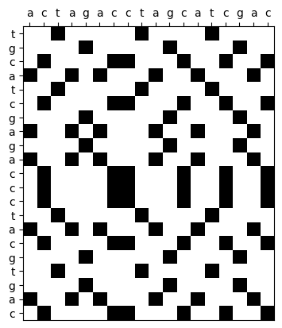
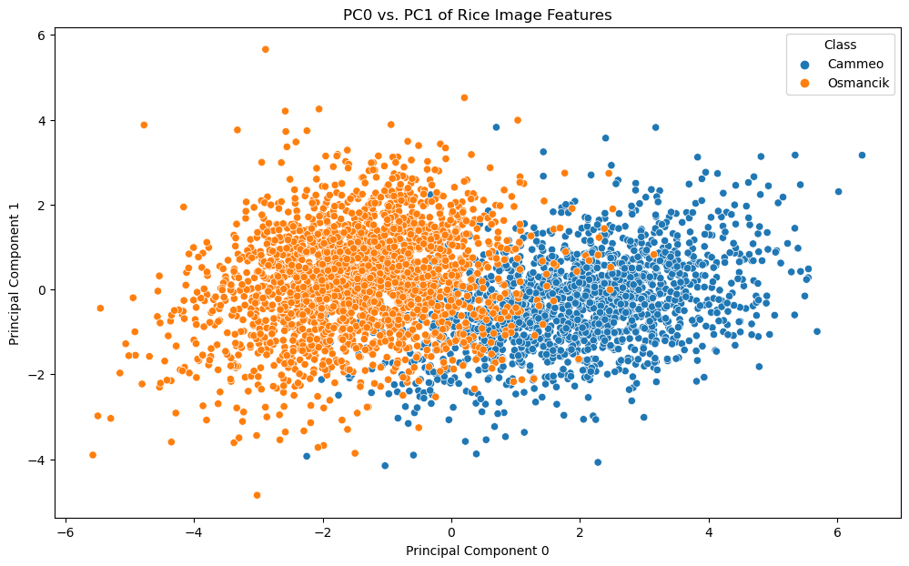

```python
# Execute the following in the terminal to install dependencies:
pip install -r requirements.txt
```

# Exercise 1: Implementing the Smith-Waterman algorithm


```python
# Plot comparison matrix for visualization purposes
import numpy as np
import matplotlib.pyplot as plt

def make_diagram(seq1, seq2):
    data = np.zeros((len(seq1), len(seq2)))
    for i, base1 in enumerate(seq1):
        for j, base2 in enumerate(seq2):
            if base1 == base2:
                data[i, j] = 1
    plt.xticks(range(len(seq2)), labels=seq2)
    plt.yticks(range(len(seq1)), labels=seq1)
    plt.imshow(data, interpolation='nearest', cmap='binary')
    plt.gca().xaxis.tick_top()

make_diagram('tgcatcgagaccctacgtgac', 'actagacctagcatcgac')
plt.show()
```


    

    


```python
# Smith-Waterman algorithm: Calculate optimal local alignment and score between two sequences
import numpy as np

def align(seq1, seq2, match=1, gap_penalty=1, mismatch_penalty=1):
    # Create scoring matrix and initialize with zeroes
    m, n = len(seq1), len(seq2)
    scoring_matrix = np.zeros((m + 1, n + 1))

    # Fill the scoring matrix using the Smith-Waterman equation
    max_score = 0    # Keeps track of maximum score in matrix
    max_pos = (0, 0)    # Position of the highest score in matrix using a tuple

    for i in range(1, m + 1):
        for j in range(1, n + 1):
            # Calculate possible scores for a match, mismatch, and gap for this cell
            matching = scoring_matrix[i - 1, j - 1] + (match if seq1[i - 1] == seq2[j - 1] else -mismatch_penalty) # Add match score if bases match, else subtract mismatch penalty
            deletion = scoring_matrix[i - 1, j] - gap_penalty # Subtract gap penalty if we want a gap in sequence 1
            insertion = scoring_matrix[i, j - 1] - gap_penalty # Subtract gap penalty if we want a gap in sequence 2

            # Choose the highest score for this cell from four scenarios
            scoring_matrix[i, j] = max(0, matching, deletion, insertion) # 0 = No similarity at all between seq1 and seq2

            # Update maximum score in matrix and position of maximum score in matrix
            if scoring_matrix[i, j] >= max_score:
                max_score = scoring_matrix[i, j] # Update maximum score
                max_pos = (i, j) # Update maximum matrix position

    # Traceback from highest score using recursion to find the optimal local alignment
    def traceback(max_pos):
        i, j = max_pos   # Unpack tuple
        align1, align2 = '', '' # Initialize final aligned sequences
        
        while scoring_matrix[i, j] > 0:
            current_score = scoring_matrix[i, j] # Score of current cell
            diagonal_score = scoring_matrix[i - 1, j - 1] # Go diagonally up?
            up_score = scoring_matrix[i, j - 1] # Go up?
            left_score = scoring_matrix[i - 1, j] # Go left?

            # Check if the trace is at a match, mismatch, or gap in the matrix
            if current_score == diagonal_score + (match if seq1[i - 1] == seq2[j - 1] else -mismatch_penalty):
                align1 += seq1[i - 1] # Add base to aligned sequence 1
                align2 += seq2[j - 1] # Add base to aligned sequence 2
                i -= 1 # Move diagonally up
                j -= 1 
            elif current_score == up_score - gap_penalty:
                align1 += '-' # Add gap to aligned sequence 1
                align2 += seq2[j - 1] # Add base to aligned sequence 2
                j -= 1 # Move up
            elif current_score == left_score - gap_penalty:
                align1 += seq1[i - 1] # Add base to aligned sequence 1
                align2 += '-' # Add gap to aligned sequence 2
                i -= 1 # Move left

        return align1[::-1], align2[::-1] # Reverse slice to return alignments in correct order

    return traceback(max_pos), max_score, scoring_matrix # Return optimal local alignment, score, and scoring matrix
```


```python
# Test the algorithm
alignment, score, matrix = align('tgcatcgagaccctacgtgac', 'actagacctagcatcgac')
print(f"Optimal local alignment: {alignment}")
print(f"Alignment score: {score}")
print(f"Scoring matrix: \n{matrix}")
```

    Optimal local alignment: ('agacccta-cgt-gac', 'aga-cctagcatcgac')
    Alignment score: 8.0
    Scoring matrix: 
    [[0. 0. 0. 0. 0. 0. 0. 0. 0. 0. 0. 0. 0. 0. 0. 0. 0. 0. 0.]
     [0. 0. 0. 1. 0. 0. 0. 0. 0. 1. 0. 0. 0. 0. 1. 0. 0. 0. 0.]
     [0. 0. 0. 0. 0. 1. 0. 0. 0. 0. 0. 1. 0. 0. 0. 0. 1. 0. 0.]
     [0. 0. 1. 0. 0. 0. 0. 1. 1. 0. 0. 0. 2. 1. 0. 1. 0. 0. 1.]
     [0. 1. 0. 0. 1. 0. 1. 0. 0. 0. 1. 0. 1. 3. 2. 1. 0. 1. 0.]
     [0. 0. 0. 1. 0. 0. 0. 0. 0. 1. 0. 0. 0. 2. 4. 3. 2. 1. 0.]
     [0. 0. 1. 0. 0. 0. 0. 1. 1. 0. 0. 0. 1. 1. 3. 5. 4. 3. 2.]
     [0. 0. 0. 0. 0. 1. 0. 0. 0. 0. 0. 1. 0. 0. 2. 4. 6. 5. 4.]
     [0. 1. 0. 0. 1. 0. 2. 1. 0. 0. 1. 0. 0. 1. 1. 3. 5. 7. 6.]
     [0. 0. 0. 0. 0. 2. 1. 1. 0. 0. 0. 2. 1. 0. 0. 2. 4. 6. 6.]
     [0. 1. 0. 0. 1. 1. 3. 2. 1. 0. 1. 1. 1. 2. 1. 1. 3. 5. 5.]
     [0. 0. 2. 1. 0. 0. 2. 4. 3. 2. 1. 0. 2. 1. 1. 2. 2. 4. 6.]
     [0. 0. 1. 1. 0. 0. 1. 3. 5. 4. 3. 2. 1. 1. 0. 2. 1. 3. 5.]
     [0. 0. 1. 0. 0. 0. 0. 2. 4. 4. 3. 2. 3. 2. 1. 1. 1. 2. 4.]
     [0. 0. 0. 2. 1. 0. 0. 1. 3. 5. 4. 3. 2. 2. 3. 2. 1. 1. 3.]
     [0. 1. 0. 1. 3. 2. 1. 0. 2. 4. 6. 5. 4. 3. 2. 2. 1. 2. 2.]
     [0. 0. 2. 1. 2. 2. 1. 2. 1. 3. 5. 5. 6. 5. 4. 3. 2. 1. 3.]
     [0. 0. 1. 1. 1. 3. 2. 1. 1. 2. 4. 6. 5. 5. 4. 3. 4. 3. 2.]
     [0. 0. 0. 2. 1. 2. 2. 1. 0. 2. 3. 5. 5. 4. 6. 5. 4. 3. 2.]
     [0. 0. 0. 1. 1. 2. 1. 1. 0. 1. 2. 4. 4. 4. 5. 5. 6. 5. 4.]
     [0. 1. 0. 0. 2. 1. 3. 2. 1. 0. 2. 3. 3. 5. 4. 4. 5. 7. 6.]
     [0. 0. 2. 1. 1. 1. 2. 4. 3. 2. 1. 2. 4. 4. 4. 5. 4. 6. 8.]]


```python
alignment, score, matrix = align('tgcatcgagaccctacgtgac', 'actagacctagcatcgac', gap_penalty=2)
print(f"Optimal local alignment: {alignment}")
print(f"Alignment score: {score}")
print(f"Scoring matrix: \n{matrix}")
```

    Optimal local alignment: ('gcatcga', 'gcatcga')
    Alignment score: 7.0
    Scoring matrix: 
    [[0. 0. 0. 0. 0. 0. 0. 0. 0. 0. 0. 0. 0. 0. 0. 0. 0. 0. 0.]
     [0. 0. 0. 1. 0. 0. 0. 0. 0. 1. 0. 0. 0. 0. 1. 0. 0. 0. 0.]
     [0. 0. 0. 0. 0. 1. 0. 0. 0. 0. 0. 1. 0. 0. 0. 0. 1. 0. 0.]
     [0. 0. 1. 0. 0. 0. 0. 1. 1. 0. 0. 0. 2. 0. 0. 1. 0. 0. 1.]
     [0. 1. 0. 0. 1. 0. 1. 0. 0. 0. 1. 0. 0. 3. 1. 0. 0. 1. 0.]
     [0. 0. 0. 1. 0. 0. 0. 0. 0. 1. 0. 0. 0. 1. 4. 2. 0. 0. 0.]
     [0. 0. 1. 0. 0. 0. 0. 1. 1. 0. 0. 0. 1. 0. 2. 5. 3. 1. 1.]
     [0. 0. 0. 0. 0. 1. 0. 0. 0. 0. 0. 1. 0. 0. 0. 3. 6. 4. 2.]
     [0. 1. 0. 0. 1. 0. 2. 0. 0. 0. 1. 0. 0. 1. 0. 1. 4. 7. 5.]
     [0. 0. 0. 0. 0. 2. 0. 1. 0. 0. 0. 2. 0. 0. 0. 0. 2. 5. 6.]
     [0. 1. 0. 0. 1. 0. 3. 1. 0. 0. 1. 0. 1. 1. 0. 0. 0. 3. 4.]
     [0. 0. 2. 0. 0. 0. 1. 4. 2. 0. 0. 0. 1. 0. 0. 1. 0. 1. 4.]
     [0. 0. 1. 1. 0. 0. 0. 2. 5. 3. 1. 0. 1. 0. 0. 1. 0. 0. 2.]
     [0. 0. 1. 0. 0. 0. 0. 1. 3. 4. 2. 0. 1. 0. 0. 1. 0. 0. 1.]
     [0. 0. 0. 2. 0. 0. 0. 0. 1. 4. 3. 1. 0. 0. 1. 0. 0. 0. 0.]
     [0. 1. 0. 0. 3. 1. 1. 0. 0. 2. 5. 3. 1. 1. 0. 0. 0. 1. 0.]
     [0. 0. 2. 0. 1. 2. 0. 2. 1. 0. 3. 4. 4. 2. 0. 1. 0. 0. 2.]
     [0. 0. 0. 1. 0. 2. 1. 0. 1. 0. 1. 4. 3. 3. 1. 0. 2. 0. 0.]
     [0. 0. 0. 1. 0. 0. 1. 0. 0. 2. 0. 2. 3. 2. 4. 2. 0. 1. 0.]
     [0. 0. 0. 0. 0. 1. 0. 0. 0. 0. 1. 1. 1. 2. 2. 3. 3. 1. 0.]
     [0. 1. 0. 0. 1. 0. 2. 0. 0. 0. 1. 0. 0. 2. 1. 1. 2. 4. 2.]
     [0. 0. 2. 0. 0. 0. 0. 3. 1. 0. 0. 0. 1. 0. 1. 2. 0. 2. 5.]]


```python
alignment, score, matrix = align('tgcatcgagaccctacgtgac', 'actagacctagcatcgac', match=3, gap_penalty=1, mismatch_penalty=2)
print(f"Optimal local alignment: {alignment}")
print(f"Alignment score: {score}")
print(f"Scoring matrix: \n{matrix}")
```

    Optimal local alignment: ('atcgagacccta-cgt-gac', 'a-ctaga-cctagcatcgac')
    Alignment score: 34.0
    Scoring matrix: 
    [[ 0.  0.  0.  0.  0.  0.  0.  0.  0.  0.  0.  0.  0.  0.  0.  0.  0.  0.
       0.]
     [ 0.  0.  0.  3.  2.  1.  0.  0.  0.  3.  2.  1.  0.  0.  3.  2.  1.  0.
       0.]
     [ 0.  0.  0.  2.  1.  5.  4.  3.  2.  2.  1.  5.  4.  3.  2.  1.  5.  4.
       3.]
     [ 0.  0.  3.  2.  1.  4.  3.  7.  6.  5.  4.  4.  8.  7.  6.  5.  4.  3.
       7.]
     [ 0.  3.  2.  1.  5.  4.  7.  6.  5.  4.  8.  7.  7. 11. 10.  9.  8.  7.
       6.]
     [ 0.  2.  1.  5.  4.  3.  6.  5.  4.  8.  7.  6.  6. 10. 14. 13. 12. 11.
      10.]
     [ 0.  1.  5.  4.  3.  2.  5.  9.  8.  7.  6.  5.  9.  9. 13. 17. 16. 15.
      14.]
     [ 0.  0.  4.  3.  2.  6.  5.  8.  7.  6.  5.  9.  8.  8. 12. 16. 20. 19.
      18.]
     [ 0.  3.  3.  2.  6.  5.  9.  8.  7.  6.  9.  8.  7. 11. 11. 15. 19. 23.
      22.]
     [ 0.  2.  2.  1.  5.  9.  8.  7.  6.  5.  8. 12. 11. 10. 10. 14. 18. 22.
      21.]
     [ 0.  3.  2.  1.  4.  8. 12. 11. 10.  9.  8. 11. 10. 14. 13. 13. 17. 21.
      20.]
     [ 0.  2.  6.  5.  4.  7. 11. 15. 14. 13. 12. 11. 14. 13. 12. 16. 16. 20.
      24.]
     [ 0.  1.  5.  4.  3.  6. 10. 14. 18. 17. 16. 15. 14. 13. 12. 15. 15. 19.
      23.]
     [ 0.  0.  4.  3.  2.  5.  9. 13. 17. 16. 15. 14. 18. 17. 16. 15. 14. 18.
      22.]
     [ 0.  0.  3.  7.  6.  5.  8. 12. 16. 20. 19. 18. 17. 16. 20. 19. 18. 17.
      21.]
     [ 0.  3.  2.  6. 10.  9.  8. 11. 15. 19. 23. 22. 21. 20. 19. 18. 17. 21.
      20.]
     [ 0.  2.  6.  5.  9.  8.  7. 11. 14. 18. 22. 21. 25. 24. 23. 22. 21. 20.
      24.]
     [ 0.  1.  5.  4.  8. 12. 11. 10. 13. 17. 21. 25. 24. 23. 22. 21. 25. 24.
      23.]
     [ 0.  0.  4.  8.  7. 11. 10.  9. 12. 16. 20. 24. 23. 22. 26. 25. 24. 23.
      22.]
     [ 0.  0.  3.  7.  6. 10.  9.  8. 11. 15. 19. 23. 22. 21. 25. 24. 28. 27.
      26.]
     [ 0.  3.  2.  6. 10.  9. 13. 12. 11. 14. 18. 22. 21. 25. 24. 23. 27. 31.
      30.]
     [ 0.  2.  6.  5.  9.  8. 12. 16. 15. 14. 17. 21. 25. 24. 23. 27. 26. 30.
      34.]]


```python
alignment, score, matrix = align('tgcatcgagaccctacgtgac', 'actagacctagcatcgac', match=2, gap_penalty=2, mismatch_penalty=2)
print(f"Optimal local alignment: {alignment}")
print(f"Alignment score: {score}")
print(f"Scoring matrix: \n{matrix}")
```

    Optimal local alignment: ('agacccta-cgt-gac', 'aga-cctagcatcgac')
    Alignment score: 16.0
    Scoring matrix: 
    [[ 0.  0.  0.  0.  0.  0.  0.  0.  0.  0.  0.  0.  0.  0.  0.  0.  0.  0.
       0.]
     [ 0.  0.  0.  2.  0.  0.  0.  0.  0.  2.  0.  0.  0.  0.  2.  0.  0.  0.
       0.]
     [ 0.  0.  0.  0.  0.  2.  0.  0.  0.  0.  0.  2.  0.  0.  0.  0.  2.  0.
       0.]
     [ 0.  0.  2.  0.  0.  0.  0.  2.  2.  0.  0.  0.  4.  2.  0.  2.  0.  0.
       2.]
     [ 0.  2.  0.  0.  2.  0.  2.  0.  0.  0.  2.  0.  2.  6.  4.  2.  0.  2.
       0.]
     [ 0.  0.  0.  2.  0.  0.  0.  0.  0.  2.  0.  0.  0.  4.  8.  6.  4.  2.
       0.]
     [ 0.  0.  2.  0.  0.  0.  0.  2.  2.  0.  0.  0.  2.  2.  6. 10.  8.  6.
       4.]
     [ 0.  0.  0.  0.  0.  2.  0.  0.  0.  0.  0.  2.  0.  0.  4.  8. 12. 10.
       8.]
     [ 0.  2.  0.  0.  2.  0.  4.  2.  0.  0.  2.  0.  0.  2.  2.  6. 10. 14.
      12.]
     [ 0.  0.  0.  0.  0.  4.  2.  2.  0.  0.  0.  4.  2.  0.  0.  4.  8. 12.
      12.]
     [ 0.  2.  0.  0.  2.  2.  6.  4.  2.  0.  2.  2.  2.  4.  2.  2.  6. 10.
      10.]
     [ 0.  0.  4.  2.  0.  0.  4.  8.  6.  4.  2.  0.  4.  2.  2.  4.  4.  8.
      12.]
     [ 0.  0.  2.  2.  0.  0.  2.  6. 10.  8.  6.  4.  2.  2.  0.  4.  2.  6.
      10.]
     [ 0.  0.  2.  0.  0.  0.  0.  4.  8.  8.  6.  4.  6.  4.  2.  2.  2.  4.
       8.]
     [ 0.  0.  0.  4.  2.  0.  0.  2.  6. 10.  8.  6.  4.  4.  6.  4.  2.  2.
       6.]
     [ 0.  2.  0.  2.  6.  4.  2.  0.  4.  8. 12. 10.  8.  6.  4.  4.  2.  4.
       4.]
     [ 0.  0.  4.  2.  4.  4.  2.  4.  2.  6. 10. 10. 12. 10.  8.  6.  4.  2.
       6.]
     [ 0.  0.  2.  2.  2.  6.  4.  2.  2.  4.  8. 12. 10. 10.  8.  6.  8.  6.
       4.]
     [ 0.  0.  0.  4.  2.  4.  4.  2.  0.  4.  6. 10. 10.  8. 12. 10.  8.  6.
       4.]
     [ 0.  0.  0.  2.  2.  4.  2.  2.  0.  2.  4.  8.  8.  8. 10. 10. 12. 10.
       8.]
     [ 0.  2.  0.  0.  4.  2.  6.  4.  2.  0.  4.  6.  6. 10.  8.  8. 10. 14.
      12.]
     [ 0.  0.  4.  2.  2.  2.  4.  8.  6.  4.  2.  4.  8.  8.  8. 10.  8. 12.
      16.]]


```python
alignment, score, matrix = align('tgcatcgagaccctacgtgac', 'actagacctagcatcgac', match=1, gap_penalty=1, mismatch_penalty=0.5)
print(f"Optimal local alignment: {alignment}")
print(f"Alignment score: {score}")
print(f"Scoring matrix: \n{matrix}")
```

    Optimal local alignment: ('cgagacccta-cgt-gac', 'ctaga-cctagcatcgac')
    Alignment score: 9.0
    Scoring matrix: 
    [[0.  0.  0.  0.  0.  0.  0.  0.  0.  0.  0.  0.  0.  0.  0.  0.  0.  0.
      0. ]
     [0.  0.  0.  1.  0.  0.  0.  0.  0.  1.  0.  0.  0.  0.  1.  0.  0.  0.
      0. ]
     [0.  0.  0.  0.  0.5 1.  0.  0.  0.  0.  0.5 1.  0.  0.  0.  0.5 1.  0.
      0. ]
     [0.  0.  1.  0.  0.  0.  0.5 1.  1.  0.  0.  0.  2.  1.  0.  1.  0.  0.5
      1. ]
     [0.  1.  0.  0.5 1.  0.  1.  0.  0.5 0.5 1.  0.  1.  3.  2.  1.  0.5 1.
      0. ]
     [0.  0.  0.5 1.  0.  0.5 0.  0.5 0.  1.5 0.5 0.5 0.  2.  4.  3.  2.  1.
      0.5]
     [0.  0.  1.  0.  0.5 0.  0.  1.  1.5 0.5 1.  0.  1.5 1.  3.  5.  4.  3.
      2. ]
     [0.  0.  0.  0.5 0.  1.5 0.5 0.  0.5 1.  0.  2.  1.  1.  2.  4.  6.  5.
      4. ]
     [0.  1.  0.  0.  1.5 0.5 2.5 1.5 0.5 0.  2.  1.  1.5 2.  1.  3.  5.  7.
      6. ]
     [0.  0.  0.5 0.  0.5 2.5 1.5 2.  1.  0.  1.  3.  2.  1.  1.5 2.  4.  6.
      6.5]
     [0.  1.  0.  0.  1.  1.5 3.5 2.5 1.5 0.5 1.  2.  2.5 3.  2.  1.  3.  5.
      5.5]
     [0.  0.  2.  1.  0.  0.5 2.5 4.5 3.5 2.5 1.5 1.  3.  2.  2.5 3.  2.  4.
      6. ]
     [0.  0.  1.  1.5 0.5 0.  1.5 3.5 5.5 4.5 3.5 2.5 2.  2.5 1.5 3.5 2.5 3.
      5. ]
     [0.  0.  1.  0.5 1.  0.  0.5 2.5 4.5 5.  4.  3.  3.5 2.5 2.  2.5 3.  2.
      4. ]
     [0.  0.  0.  2.  1.  0.5 0.  1.5 3.5 5.5 4.5 3.5 2.5 3.  3.5 2.5 2.  2.5
      3. ]
     [0.  1.  0.  1.  3.  2.  1.5 0.5 2.5 4.5 6.5 5.5 4.5 3.5 2.5 3.  2.  3.
      2. ]
     [0.  0.  2.  1.  2.  2.5 1.5 2.5 1.5 3.5 5.5 6.  6.5 5.5 4.5 3.5 2.5 2.
      4. ]
     [0.  0.  1.  1.5 1.  3.  2.  1.5 2.  2.5 4.5 6.5 5.5 6.  5.  4.  4.5 3.5
      3. ]
     [0.  0.  0.  2.  1.  2.  2.5 1.5 1.  3.  3.5 5.5 6.  5.  7.  6.  5.  4.
      3. ]
     [0.  0.  0.  1.  1.5 2.  1.5 2.  1.  2.  2.5 4.5 5.  5.5 6.  6.5 7.  6.
      5. ]
     [0.  1.  0.  0.  2.  1.  3.  2.  1.5 1.  3.  3.5 4.  6.  5.  5.5 6.  8.
      7. ]
     [0.  0.  2.  1.  1.  1.5 2.  4.  3.  2.  2.  2.5 4.5 5.  5.5 6.  5.  7.
      9. ]]

# Exercise 2: 2-dimensional k-nearest neighbors classifiers (quad tree and direct search)


```python
# Load the data
import pandas as pd

data = pd.read_excel("Rice_Cammeo_Osmancik.xlsx")
```


```python
# Normalize quantitative columns to mean 0 and standard deviation 1
from sklearn.preprocessing import StandardScaler

cols_to_norm = ["Area", "Perimeter", "Major_Axis_Length", "Minor_Axis_Length", "Eccentricity", "Convex_Area", "Extent"]
data[cols_to_norm] = StandardScaler().fit_transform(data[cols_to_norm])
data.head()
```


<div>
<style scoped>
    .dataframe tbody tr th:only-of-type {
        vertical-align: middle;
    }

    .dataframe tbody tr th {
        vertical-align: top;
    }

    .dataframe thead th {
        text-align: right;
    }
</style>
<table border="1" class="dataframe">
  <thead>
    <tr style="text-align: right;">
      <th></th>
      <th>Area</th>
      <th>Perimeter</th>
      <th>Major_Axis_Length</th>
      <th>Minor_Axis_Length</th>
      <th>Eccentricity</th>
      <th>Convex_Area</th>
      <th>Extent</th>
      <th>Class</th>
    </tr>
  </thead>
  <tbody>
    <tr>
      <th>0</th>
      <td>1.479830</td>
      <td>2.004354</td>
      <td>2.348547</td>
      <td>-0.212943</td>
      <td>2.018337</td>
      <td>1.499659</td>
      <td>-1.152921</td>
      <td>Cammeo</td>
    </tr>
    <tr>
      <th>1</th>
      <td>1.147870</td>
      <td>1.125853</td>
      <td>0.988390</td>
      <td>0.945568</td>
      <td>0.410018</td>
      <td>1.192918</td>
      <td>-0.602079</td>
      <td>Cammeo</td>
    </tr>
    <tr>
      <th>2</th>
      <td>1.135169</td>
      <td>1.317214</td>
      <td>1.451908</td>
      <td>0.253887</td>
      <td>1.212956</td>
      <td>1.126504</td>
      <td>0.405611</td>
      <td>Cammeo</td>
    </tr>
    <tr>
      <th>3</th>
      <td>0.293436</td>
      <td>0.115300</td>
      <td>0.261439</td>
      <td>0.198051</td>
      <td>0.239751</td>
      <td>0.233857</td>
      <td>-0.275351</td>
      <td>Cammeo</td>
    </tr>
    <tr>
      <th>4</th>
      <td>1.166345</td>
      <td>1.487053</td>
      <td>1.316442</td>
      <td>0.523419</td>
      <td>0.952221</td>
      <td>1.299855</td>
      <td>-0.206013</td>
      <td>Cammeo</td>
    </tr>
  </tbody>
</table>
</div>


```python
# Reduce the data to two dimensions using PCA
from sklearn import decomposition

pca = decomposition.PCA(n_components=2)
data_reduced = pca.fit_transform(data[cols_to_norm])
pc0 = data_reduced[:, 0]
pc1 = data_reduced[:, 1]
data_pca = pd.DataFrame({"pc0": pc0, "pc1": pc1})
```


```python
# Generate scatterplot of PC0 vs PC1 for visualization
import matplotlib.pyplot as plt
import seaborn as sns

plt.figure(figsize=(12,7))
sns.scatterplot(data = data_pca, x = "pc0", y = "pc1", hue = data["Class"])
plt.title("PC0 vs. PC1 of Rice Image Features")
plt.xlabel("Principal Component 0")
plt.ylabel("Principal Component 1")
plt.show()
```


    

    


**Interpretation:** The plot shows good (but not perfect) separation of the two classes of rice in the dataset, indicating that the use of PCA to reduce the dimensionality of this dataset will assist in 2-dimensional k-nearest neighbors classification on this dataset. I expect good (but not perfect) classification performance based on this plot.


```python
# Split the data into training and test sets and prepare reduced data
from sklearn.model_selection import train_test_split
from sklearn.decomposition import PCA

data = pd.read_excel("Rice_Cammeo_Osmancik.xlsx") # Re-load the data
train, test = train_test_split(data, test_size=0.3, random_state=100) # Split into training and test sets (70/30 split)

# Make copies to avoid pandas raising SettingWithCopyWarning
train = train.copy()
test = test.copy()

# Normalize the columns according to their own mean and standard deviation
cols_to_norm = ["Area", "Perimeter", "Major_Axis_Length", "Minor_Axis_Length", "Eccentricity", "Convex_Area", "Extent"]
scaler = StandardScaler()
train.loc[:, cols_to_norm] = scaler.fit_transform(train[cols_to_norm])
test.loc[:, cols_to_norm] = scaler.transform(test[cols_to_norm])  # Note: use the same scaler for test data

# Reduce train and test sets to 2 dimensions using PCA
pca = PCA(n_components=2)
train_pca = pca.fit_transform(train[cols_to_norm])
train_reduced = pd.DataFrame({"x": train_pca[:, 0], "y": train_pca[:, 1], "class": train["Class"]})
test_pca = pca.transform(test[cols_to_norm])
test_reduced = pd.DataFrame({"x": test_pca[:, 0], "y": test_pca[:, 1], "class": test["Class"]})
```


```python
# Define function for calculating the Euclidean distance
def euclidean_distance(point_1, point_2):
    return ((point_1[0] - point_2[0])**2 + (point_1[1] - point_2[1])**2)**0.5
```


```python
# 2-D k-nearest neighbors classifier by quad tree search (without np.argpartition, which doesn't seem to work well)
def knn_quadtree(root, test_point, k):
    nearest_neighbors = [] # Store the nearest neighbors as a list of (distance, point) tuples
    radius = 0.1  # Initial search circle radius

    # Search the quad tree recursively
    def search_tree(node):
        nonlocal radius, nearest_neighbors # Allow access to variables in knn_quadtree() scope
        # If the node is a leaf, check all points in the node
        if node.is_leaf():
            for point in node.points:
                 # Calculate the distance between the test point and the point in the node
                dist = euclidean_distance(test_point, point[:2])
                # If the point is within the search circle radius...
                if dist <= radius:
                    nearest_neighbors.append((dist, point)) # Add it to the list of nearest neighbors
            # Sort the list of nearest neighbors by distance
            nearest_neighbors.sort(key=lambda x: x[0])
            # Keep only the k nearest neighbors
            nearest_neighbors = nearest_neighbors[:k]
        # If the node is not a leaf...
        else:
            for child in node.children:
                # Check if its children are within the search radius
                if child and child.within_distance(*test_point, radius):
                    # If the child is within the search radius, recurse through it
                    search_tree(child)

    # If there are less than k nearest neighbors...
    while len(nearest_neighbors) < k:
        nearest_neighbors.clear() # Clear the list of nearest neighbors
        search_tree(root) # Recurse through the quad tree
        radius *= 2  # Double the radius and loop until there are k nearest neighbors

    return [point for _, point in nearest_neighbors] # Return the list of k nearest neighbors
```


```python
# quadtree.py source code for submission
class QuadTreeNode:
    """Constructs a new node with the given x and y ranges and points. If node
    has more than 4 points, it will be split into 4 child nodes."""
    def __init__(self, x_range, y_range, points=None, parent=None):
        self.x_range = x_range  # (x_min, x_max)
        self.y_range = y_range  # (y_min, y_max)
        self.points = points if points else []  # Distribute points to this node if given
        self.parent = parent  # Parent node
        self.children = []  # Child nodes

        # If this node has more than 4 points, split it into 4 child nodes
        if len(self.points) > 4:
            self.split()

    """Splits this node into 4 child nodes based on bounding box quadrants
    defined by the midpoints of x and y. Points are assigned to child nodes
    based on which quadrant of the bounding box they fall into."""
    def split(self):
        # Find midpoints of x and y ranges
        x_mid = (self.x_range[0] + self.x_range[1]) / 2
        y_mid = (self.y_range[0] + self.y_range[1]) / 2

        # Bounding box quadrants = ((x_min, x_max), (y_min, y_max))
        quadrants = [
            ((self.x_range[0], x_mid), (self.y_range[0], y_mid)),  # Bottom left quadrant
            ((x_mid, self.x_range[1]), (self.y_range[0], y_mid)),  # Bottom right quadrant
            ((self.x_range[0], x_mid), (y_mid, self.y_range[1])),  # Top left quadrant
            ((x_mid, self.x_range[1]), (y_mid, self.y_range[1]))  # Top right quadrant
        ]

        # Create a child node for each bounding box quadrant
        for quadrant in quadrants:
            # Find points that fall within the quadrant
            child_points = [point for point in self.points if self.point_in_range(point, quadrant)]
            # Create a child node for the quadrant
            child_node = QuadTreeNode(quadrant[0], quadrant[1], child_points, self)
            # Add the child node to this node's children
            self.children.append(child_node)

        self.points = []  # Purge this node's points list since they are now in child nodes

    """Checks if the point (x, y) is within this node's bounds."""
    def contains(self, x, y):
        return self.x_range[0] <= x <= self.x_range[1] and self.y_range[0] <= y <= self.y_range[1]

    """Checks if the given point is within the given range."""
    def point_in_range(self, point, quadrant):
        # Unpack quadrant into x and y ranges
        (x_min, x_max), (y_min, y_max) = quadrant
        # Unpack point into x and y coordinates
        x, y, _ = point
        # Check if point is within the given range
        return x_min <= x <= x_max and y_min <= y <= y_max

    """Returns the smallest node that contains the given point."""
    def small_containing_quadtree(self, x, y):
        # If this node is a leaf or does not contain the given point, return this node
        if self.is_leaf() or not self.contains(x, y):
            return self
        # Otherwise, check if any child nodes contain the given point
        for child in self.children:
            if child.contains(x, y):
                return child.small_containing_quadtree(x, y)
        return self

    """Calculates the distance between two points in this node or its child nodes."""
    @staticmethod
    def euclidean_distance(point_1, point_2):
        return ((point_1[0] - point_2[0])**2 + (point_1[1] - point_2[1])**2)**0.5

    """Checks if the given point (x, y) is within the given distance d of this node
    or its child nodes."""
    def within_distance(self, x, y, d):
        closest_x = max(self.x_range[0], min(x, self.x_range[1]))
        closest_y = max(self.y_range[0], min(y, self.y_range[1]))
        return self.euclidean_distance((x, y), (closest_x, closest_y)) <= d

    """Checks if this node is a leaf (does not have any children)."""
    def is_leaf(self):
        return len(self.children) == 0

    """Returns all leaves within a given distance of the given point (x, y)."""
    def leaves_within_distance(self, x, y, d):
        # Return this leaf if it is within the given distance d
        if self.is_leaf():
            return [self] if self.within_distance(x, y, d) else []
        # Otherwise, recurse through this node's children and return all leaves within the given distance d
        return [leaf for child in self.children for leaf in child.leaves_within_distance(x, y, d)]

    """Return all points in this node and its children."""
    def all_points(self):
        # Checks if this node is a leaf; return its points if so
        if self.is_leaf():
            return self.points
        # Otherwise, recurse through this node's children and return all points within them
        return [point for child in self.children for point in child.all_points()]
```


```python
# Store training data ((x, y), class) in self-constructing quad tree
from quadtree import QuadTreeNode

root = QuadTreeNode(x_range=(-5, 5), 
                    y_range=(-5, 5), 
                    points=train_reduced.values.tolist())
```


```python
# Generate confusion matrices for k=1 and k=5 for k-NN quad tree
from sklearn.metrics import confusion_matrix

def predict_labels_quadtree(root, test_data, k):
    predictions = []
    for point in test_data:
        # Predict the class based on the majority class of the neighbors
        neighbors = knn_quadtree(root, (point[0], point[1]), k)
        classes = [neighbor[2] for neighbor in neighbors]
        prediction = max(set(classes), key=classes.count)
        predictions.append(prediction)
    return predictions

# Predict the labels for the test data
predicted_labels_k_1 = predict_labels_quadtree(root, test_reduced.values.tolist(), k=1)
predicted_labels_k_5 = predict_labels_quadtree(root, test_reduced.values.tolist(), k=5)

# Extract the actual labels from your test data
actual_labels = [point[2] for point in test_reduced.values.tolist()]

# Generate confusion matrices for k=1 and k=5
print(f"k-NN quad tree confusion matrix for k=1: \n{confusion_matrix(actual_labels, predicted_labels_k_1)}")
print(f"k-NN quad tree confusion matrix for k=5: \n{confusion_matrix(actual_labels, predicted_labels_k_5)}")
```

    Quad tree confusion matrix for k=1: 
    [[588  80]
     [ 83 773]]
    Quad tree confusion matrix for k=5: 
    [[606  62]
     [ 64 792]]


```python
# 2-D k-nearest neighbors classifier by direct distance measurement (for validation)
import numpy as np

def direct_knn(points, test_point, k):
    distances = [euclidean_distance(test_point, (x, y)) for x, y, _ in points]
    nearest_indices = np.argpartition(distances, k)[:k]
    return [points[i] for i in nearest_indices]
```


```python
# Generate confusion matrices for k=1 and k=5 for k-NN direct distance measurement (for validation)
from sklearn.metrics import confusion_matrix

def predict_labels_direct(train_data, test_data, k):
    predictions = []
    for point in test_data:
        # Predict the class based on the majority class of the neighbors
        neighbors = direct_knn(train_data, (point[0], point[1]), k)
        classes = [neighbor[2] for neighbor in neighbors]
        prediction = max(set(classes), key=classes.count)
        predictions.append(prediction)
    return predictions

# Predict the labels for the test data
predicted_labels_k_1 = predict_labels_direct(train_reduced.values.tolist(), test_reduced.values.tolist(), k=1)
predicted_labels_k_5 = predict_labels_direct(train_reduced.values.tolist(), test_reduced.values.tolist(), k=5)

# Extract the actual labels from your test data
actual_labels = [point[2] for point in test_reduced.values.tolist()]

# Generate confusion matrices for k=1 and k=5
print(f"Direct k-NN confusion matrix for k=1: \n{confusion_matrix(actual_labels, predicted_labels_k_1)}")
print(f"Direct k-NN confusion matrix for k=5: \n{confusion_matrix(actual_labels, predicted_labels_k_5)}")
```

    Direct k-NN confusion matrix for k=1: 
    [[588  80]
     [ 83 773]]
    Direct k-NN confusion matrix for k=5: 
    [[606  62]
     [ 64 792]]


**Interpretation:** A confusion matrix shows a classifier's performance, displaying the numbers of true positives, false positives, false negatives, and true negatives in the comparison between the ground truth class and the classifier's predicted class for each data point. Assuming no errors in implementation, the confusion matrices for my quad tree k-NN algorithm and direct k-NN algorithm perform the same, indicating that the classifiers' performance should at least be consistent. In addition, in all tests, there appear to be many more true positives and true negatives than false positives and false negatives, indicating decent classification performance.

# Exercise 3: National Cancer Institute cancer map server in Flask

**Data cleaning note:** Cancer incidence data comes from the National Cancer Institute's [Incidence Rates Table generator](https://statecancerprofiles.cancer.gov/incidencerates/index.php) in the State Cancer Profiles section. The following data options were selected to generate the CSV:

1. Area: United States
2. Area Type: By State
3. Cancer: All Cancer Sites
4. Race/Ethnicity: All Races (Includes Hispanic)
5. Sex: Both Sexes
6. Age: All Ages
7. Stage: All Stages
8. Year: Latest 5-Year Average

The following steps were then performed manually on the generated CSV:

1. Removed Data Options remarks at the beginning of the CSV file to avoid confusing the Pandas parser.
2. Removed the data source superscripts in the State column.
3. Removed "(SEER + NPCR)" from the "US" row in the State column.
4. Simplified column names for readability.
5. Removed footnotes.


```python
# Import cleaned data
import pandas as pd

data = pd.read_csv("incd.csv")
data.head()
```


<div>
<style scoped>
    .dataframe tbody tr th:only-of-type {
        vertical-align: middle;
    }

    .dataframe tbody tr th {
        vertical-align: top;
    }

    .dataframe thead th {
        text-align: right;
    }
</style>
<table border="1" class="dataframe">
  <thead>
    <tr style="text-align: right;">
      <th></th>
      <th>State</th>
      <th>FIPS</th>
      <th>Age-Adjusted Incidence Rate (cases per 100,000)</th>
      <th>Lower 95% Confidence Interval</th>
      <th>Upper 95% Confidence Interval</th>
      <th>CI*Rank</th>
      <th>Lower CI (CI*Rank)</th>
      <th>Upper CI (CI*Rank)</th>
      <th>Average Annual Count</th>
      <th>Recent Trend</th>
      <th>Recent 5-Year Trend in Incidence Rates</th>
      <th>Lower 95% Confidence Interval.1</th>
      <th>Upper 95% Confidence Interval.1</th>
    </tr>
  </thead>
  <tbody>
    <tr>
      <th>0</th>
      <td>US</td>
      <td>0</td>
      <td>442.3</td>
      <td>442</td>
      <td>442.6</td>
      <td>N/A</td>
      <td>N/A</td>
      <td>N/A</td>
      <td>1698328</td>
      <td>stable</td>
      <td>-0.3</td>
      <td>-0.6</td>
      <td>0.1</td>
    </tr>
    <tr>
      <th>1</th>
      <td>Kentucky</td>
      <td>21000</td>
      <td>506.8</td>
      <td>504.1</td>
      <td>509.6</td>
      <td>1</td>
      <td>1</td>
      <td>1</td>
      <td>27911</td>
      <td>stable</td>
      <td>-0.3</td>
      <td>-0.8</td>
      <td>0.2</td>
    </tr>
    <tr>
      <th>2</th>
      <td>Iowa</td>
      <td>19000</td>
      <td>486.8</td>
      <td>483.6</td>
      <td>490</td>
      <td>2</td>
      <td>2</td>
      <td>4</td>
      <td>19197</td>
      <td>rising</td>
      <td>1.0</td>
      <td>0.3</td>
      <td>1.8</td>
    </tr>
    <tr>
      <th>3</th>
      <td>West Virginia</td>
      <td>54000</td>
      <td>482.4</td>
      <td>478.4</td>
      <td>486.4</td>
      <td>3</td>
      <td>2</td>
      <td>6</td>
      <td>12174</td>
      <td>stable</td>
      <td>-0.2</td>
      <td>-0.4</td>
      <td>0.1</td>
    </tr>
    <tr>
      <th>4</th>
      <td>New Jersey</td>
      <td>34000</td>
      <td>481.9</td>
      <td>480</td>
      <td>483.7</td>
      <td>4</td>
      <td>2</td>
      <td>5</td>
      <td>53389</td>
      <td>falling</td>
      <td>-0.5</td>
      <td>-0.7</td>
      <td>-0.4</td>
    </tr>
  </tbody>
</table>
</div>


```python
# Extract columns of interest
incidence_rates = data[['State', 'Age-Adjusted Incidence Rate (cases per 100,000)']]
incidence_rates.head()
```


<div>
<style scoped>
    .dataframe tbody tr th:only-of-type {
        vertical-align: middle;
    }

    .dataframe tbody tr th {
        vertical-align: top;
    }

    .dataframe thead th {
        text-align: right;
    }
</style>
<table border="1" class="dataframe">
  <thead>
    <tr style="text-align: right;">
      <th></th>
      <th>State</th>
      <th>Age-Adjusted Incidence Rate (cases per 100,000)</th>
    </tr>
  </thead>
  <tbody>
    <tr>
      <th>0</th>
      <td>US</td>
      <td>442.3</td>
    </tr>
    <tr>
      <th>1</th>
      <td>Kentucky</td>
      <td>506.8</td>
    </tr>
    <tr>
      <th>2</th>
      <td>Iowa</td>
      <td>486.8</td>
    </tr>
    <tr>
      <th>3</th>
      <td>West Virginia</td>
      <td>482.4</td>
    </tr>
    <tr>
      <th>4</th>
      <td>New Jersey</td>
      <td>481.9</td>
    </tr>
  </tbody>
</table>
</div>


```python
# Save as CSV file
incidence_rates.to_csv('nci_server/incidence_rates.csv')
```


```python
# Execute the following in the terminal to start the server
python pset_4/nci_server/server.py
```


```python
# server.py source code for submission
# Implement an NCI cancer incidence lookup API as a web server in Flask
from flask import Flask, render_template, request, jsonify
import pandas as pd

app = Flask(__name__)


# Main/index page with form
@app.route("/")
def index():
    return render_template("index.html")


# API endpoint for state
@app.route("/state/<string:name>")
def state(name):
    data = pd.read_csv("incidence_rates.csv")
    if name == "US" or name == "U.S." or name == "United States":
        name = "US"
    elif name == "DC" or name == "D.C.":
        name = "District of Columbia"
    elif name not in data["State"]:
        return render_template("error.html")
    else:
        name.capitalize()
    entry = dict(data[data["State"].str.contains(name)].iloc[0, [1, 2]])
    return jsonify(entry)


# Info page with results
@app.route("/info/", methods=["GET"])
def info():
    state = request.args.get("state")
    data = pd.read_csv("incidence_rates.csv")
    if state == "U.S." or state == "United States":
        state = "US"
    elif state == "DC" or state == "D.C.":
        state = "District of Columbia"
    elif state not in data["State"]:
        return render_template("error.html")
    else:
        state.capitalize()
    rate = float(data[data["State"].str.contains(state)].iloc[0, 2])
    return render_template("info.html", state=state, rate=rate)


# Prevents execution if imported
if __name__ == '__main__':
    app.run(debug=True,  # Allows for verbose error messages
            ssl_context=("cert.pem", "key.pem"),  # SSL cert/key
            host='0.0.0.0',  # Allows external connections
            port=5000)  # Port to run on
```

**Extension of exercise:** To extend the exercise, I added styling for all pages via CSS and the ability to submit form input by pressing enter using a JQuery event listener. For fun, I also added a favicon. I implemented input validation by creating an extra HTML template as an error page that handles invalid form entry. Lastly, I (unsuccessfully) attempted to implement HTTPS support by generating my own SSL keys, which are included in the server directory.
